# Azure IoT User Manual

The Azure IoT Hub (Azure IoT for short) is hosted in the cloud as the central message center for bidirectional communication between IoT applications and devices managed by them. You can establish reliable and secure communication between millions of IoT devices and backend of cloud-hosting solutions and generate IoT solutions through the Azure IoT. This allows users to connect any device to the IoT Hub. 

The edge computing gateway InGateway902 (IG902 for short) provides the Device Supervisor app (Device Supervisor for short) to help users connect their devices to the Azure IoT. This document uses IG902 as an example to describe how to submit service data and deliver configuration data between the Device Supervisor and the Azure IoT.

  - [Prerequisites](#prerequisites)
  - [1. Environment Preparation](#environmental-preparation)
    - [1.1 Configuring the Azure IoT](#azure-configuration)
      - [1.1.1 Adding the IoT Hub](#add-iothub)
      - [1.1.2 Adding the IoT Device](#add-iot-device)
    - [1.2 Configuring the Edge Computing Gateway](#edge-computing-gateway-configuration)
      - [1.2.1 Basic Configuring](#basic-configuration)
      - [1.2.2 Data Collecting Configuration](#configure-data-collection)
  - [2. Message Publishing and Subscription](#start-test)
    - [2.1 Connecting to the Azure IoT](#connect-to-azure-iot)
    - [2.2 Publishing Messages to the Azure IoT](#publish-to-azure-iot)
    - [2.3 Subscribing to Azure IoT Messages](#subscrip-azure-iot)
  - [Appendix](#appendix)
    - [Example of Publishing Messages to the Azure IoT](#publish-azure-iot-message-example)
    - [Example of Subscribing to Azure IoT Messages](#sample-subscription-to-azure-iot-messages)
    - [Device Supervisor Azure IoT API Description](#azure-iot-api-interface-description-of-device-supervisor)
  - [FAQ](#faq)
    - [Q1: The Azure IoT Connection Frequently Fails Shortly After It Is Established](#q1)

<a id="prerequisites"> </a>

## Prerequisites

- Azure cloud platform account
- Edge computing gateway IG501/IG902
  - Firmware version
    - IG902: `IG9-V2.0.0.r12754` or later
    - IG501: `IG5-V2.0.0.r12884` or later
  - SDK version
    - IG902: `py3sdk-V1.4.0_Edge-IG9` or later
    - IG501: `py3sdk-V1.4.0_Edge-IG5` or later
  - App version: `device_supervisor-V1.2.5` or later

<a id="environmental-preparation"> </a>

## 1. Environment Preparation

- [1.1 Configuring the Azure IoT](#azure-configuration)
- [1.2 Configuring the Edge Computing Gateway](#edge-computing-gateway-configuration)

<a id="azure-configuration"> </a>

### 1.1 Configuring the Azure IoT

- [1.1.1 Adding the IoT Hub](#add-iothub)
- [1.1.2 Adding the IoT Device](#add-iot-device)

If you have configured the IoT Hub and IoT device in the Azure IoT, go to [1.2 Configuring the Edge Computing Gateway](#edge-computing-gateway-configuration). Otherwise, perform the following steps to configure the Azure IoT.   
Visit <https://portal.azure.cn/> to log in to Azure.

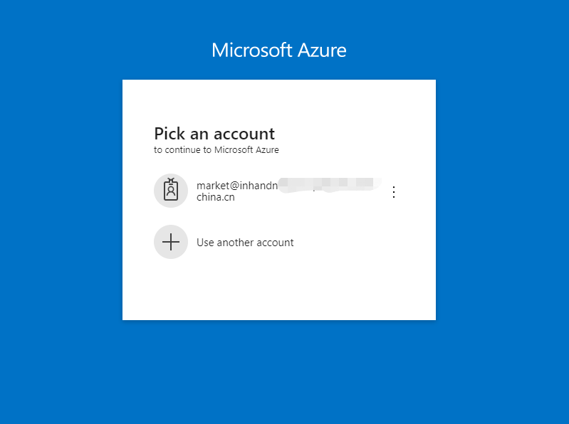

<a id="add-iothub"> </a>

#### 1.1.1 Adding the IoT Hub

Choose **IoT Hub** after login, as shown in the following figure:

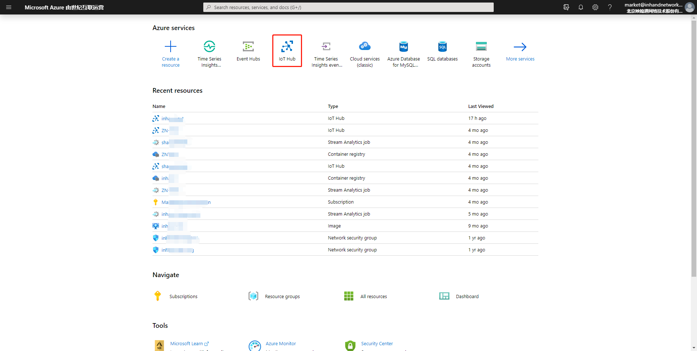

Click **Add** to create an IoT Hub.

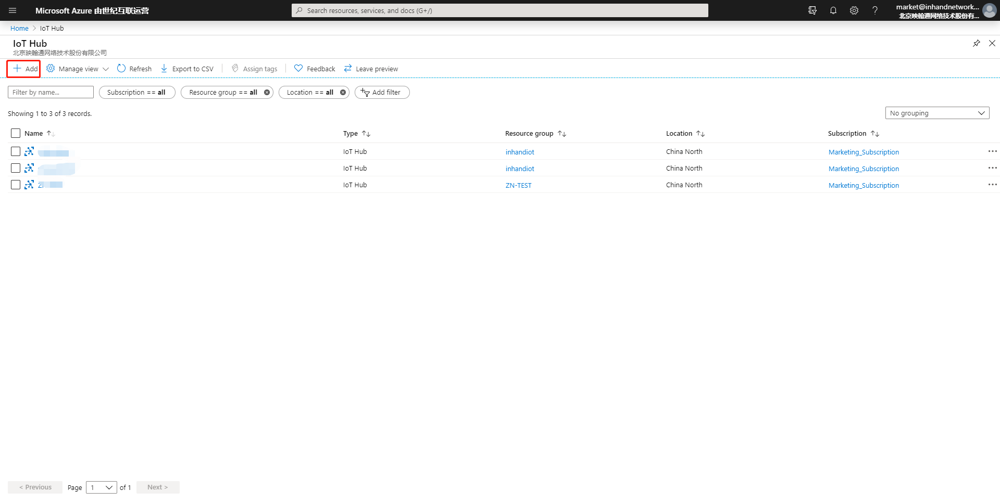

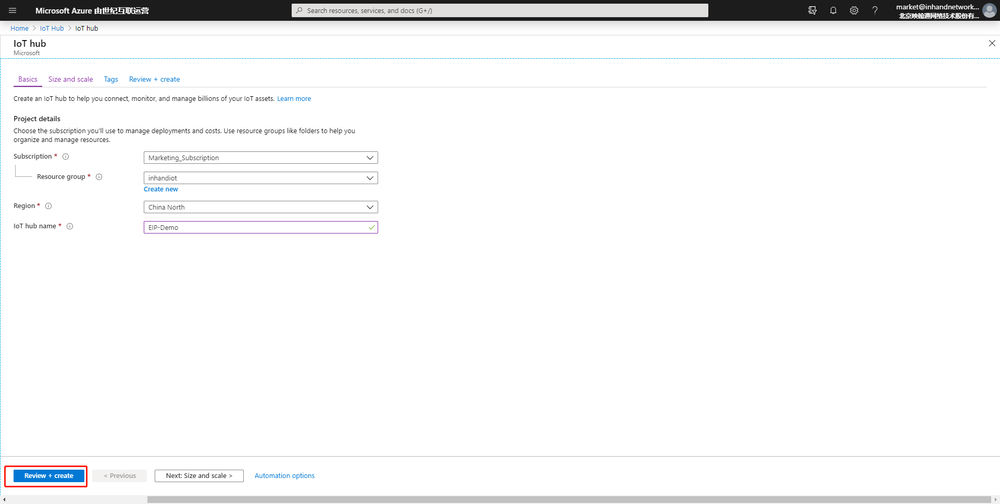

The following figure is displayed after the IoT Hub is created:

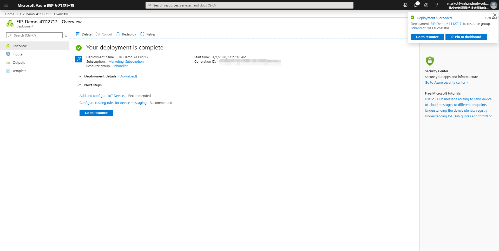

<a id="add-iot-device"> </a>

#### 1.1.2 Adding the IoT Device

Create an IoT device in the IoT Hub.


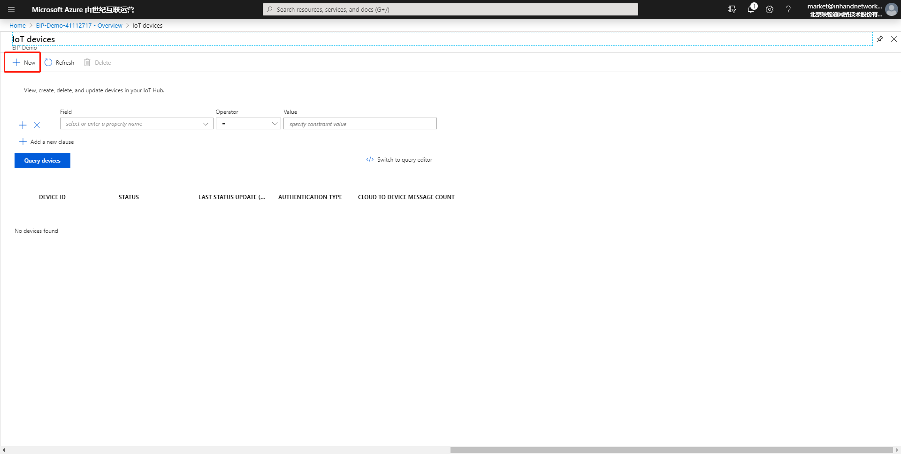

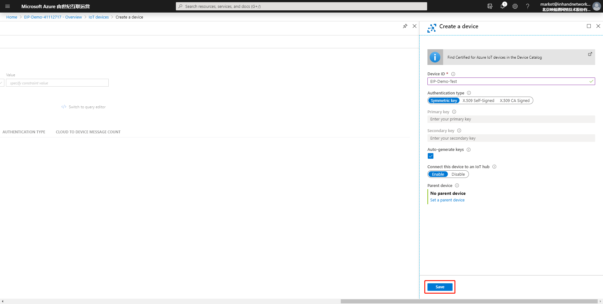

The following figure is displayed after the IoT device is created:

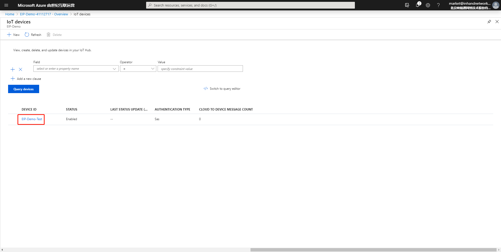

<a id="edge-computing-gateway-configuration"> </a>

### 1.2 Configuring the Edge Computing Gateway

- [1.2.1 Basic Configuring](#basic-configuration)
- [1.2.2 Data Collecting Configuration](#configure-data-collection)

<a id="basic-configuration"> </a>

#### 1.2.1 Basic Configuring

- For details about IG902 connection configuration and software version update, see [IG902 Quick Guide](http://manual.ig.inhandnetworks.com/en/latest/IG902-Quick-Start-Manual.html).
- For details about IG501 connection configuration and software version update, see [IG501 Quick Guide](http://manual.ig.inhandnetworks.com/en/latest/IG501-Quick-Start-Manual.html).

<a id="configure-data-collection"> </a>

#### 1.2.2 Data Collecting Configuration

For details about the basic data collection configuration for the Device Supervisor, see [Device Supervisor App User Manual](http://app.ig.inhandnetworks.com/en/latest/Device-Supervisor-User-Manual-EN.html). The following figure shows the data collection configuration in this document:

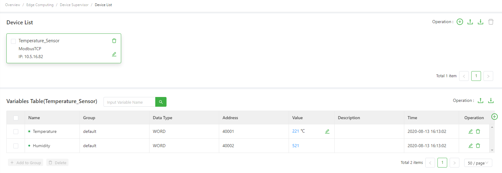

<a id="start-test"> </a>

## 2. Message Publishing and Subscription

- [2.1 Connecting to the Azure IoT](#connect-to-azure-iot)
- [2.2 Publishing Messages to the Azure IoT](#publish-to-azure-iot)
- [2.3 Subscribing to Azure IoT Messages](#subscrip-azure-iot)

<a id="connect-to-azure-iot"> </a>

### 2.1 Connecting to the Azure IoT

Choose **Edge Computing > Device Supervisor > Cloud** on IG902, select **Enable Cloud Service**, and select **Azure IoT** from the Type drop-down list. The following is a configuration example:

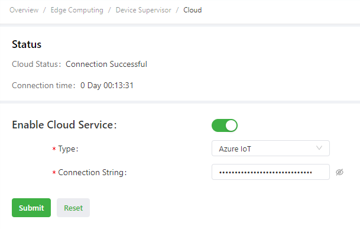

The parameters are described as follows:

- `Type`: select **Azure IoT** for an Azure IoT connection.

- `Connection String`: main connection string of the Azure IoT device. You can select the device from the IoT Hub in the Azure IoT and copy the main connection string to here.
  
  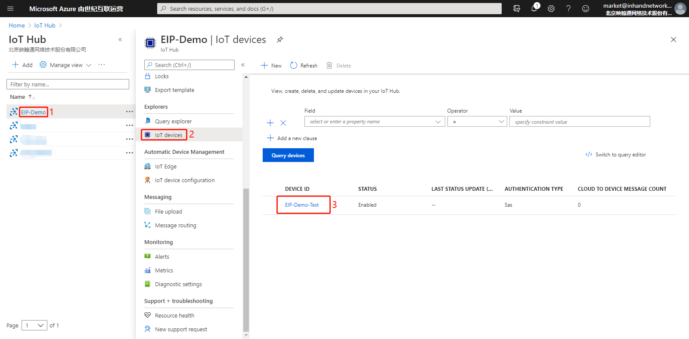
  
  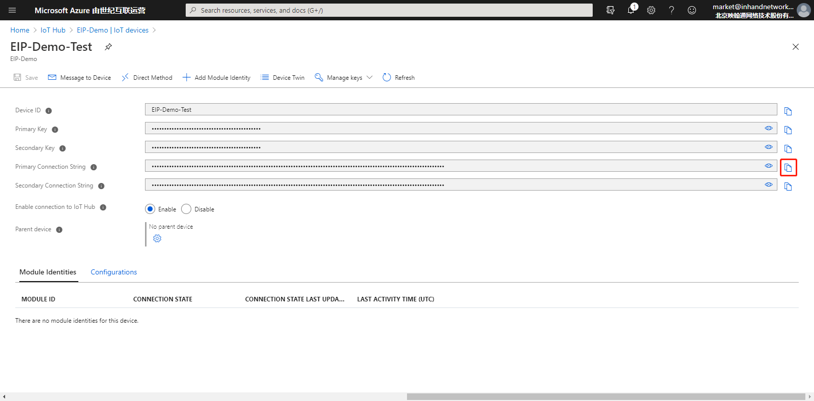

<a id="publish-to-azure-iot"> </a>

### 2.2 Publishing Messages to the Azure IoT

- Step 1: Configure the message to be published.
  
  Choose **Cloud > Message Management** and add the message to be published. The following figure shows the configuration:
  
  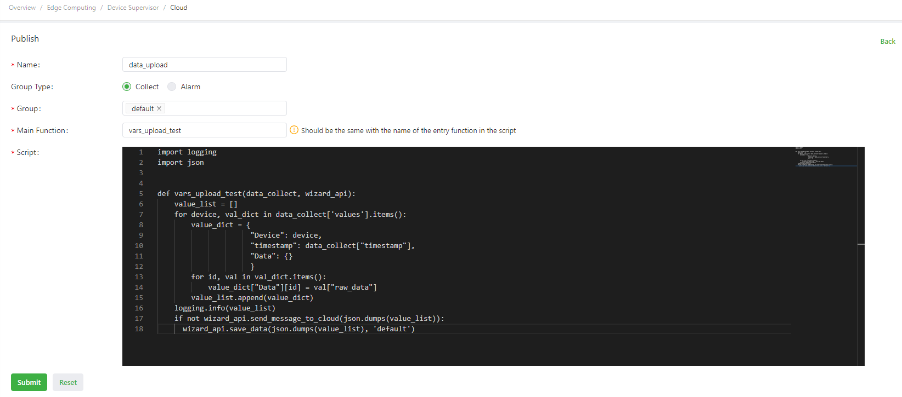
  
  ```python
  import logging
  """
  Logs are generally generated in the gateway in the following ways:
  1. import logging: uses logging.info(XXX) to generate logs. Display of logs generated in this way is not controlled by the log level parameter on the global parameter page.
  2. from common.Logger import logger: uses logger.info(XXX) to generate logs. Display of logs generated in this way is controlled by the log level parameter on the global parameter page.
  """
  
  def vars_upload_test(data_collect, wizard_api): # Define the main publishing function.
      value_list = [] # Define the data list.
      for device, val_dict in data_collect['values'].items(): # Traverse the values dictionary. The dictionary contains the device name and the variables of the device.
          value_dict = { # Customize the data dictionary.
                        "Device": device,
                        "timestamp": data_collect["timestamp"],
                        "Data": {}
                        }
          for id, val in val_dict.items(): # Traverse variables and assign values for the Data dictionary.
              value_dict["Data"][id] = val["raw_data"]
          value_list.append(value_dict) # Add data in value_dict to value_list in sequence.
      logging.info(value_list) # Print data in value_list in app logs in the following format: [{'Device': 'S7-1200', 'timestamp': 1589538347.5604711, 'Data': {'Test1': False, 'Test2': 12}}].
      return value_list # Send value_list to the app, which then uploads it to the MQTT server by collection time. If it fails to be sent, cache the data and upload it to the MQTT server by collection time after the connection recovers.
  ```
  
  The message publishing parameters are described as follows:
  
  - `Name`: custom publication name.
  - `Group Type`: when publishing variable data, select **Collection**. Then, only **Collection Group** is available in `Group`. When publishing alarm data, select **Alarm**. Then, only **Alarm Group** is available in `Group`.
  - `Group`: after a group is selected, all variables in this group are uploaded to the MQTT server according to the publication configuration. If you select multiple groups, the script logic in the publication is executed for the variables in each group at the collection interval of the groups. <font color=#FF0000>The group must include variables. Otherwise, the script logic in the publication is not executed.</font>
  - `Main Function`: name of the main function (entry function), which must be consistent with that in the script.
  - `Script`: uses Python code to customize the packaging and processing logic. The main function parameters are as follows:
    - `Parameter 1`: same as `Parameter 1` in the main function of [Standard MQTT-Publishing](http://app.ig.inhandnetworks.com/en/latest/Device-Supervisor-User-Manual-EN.html#publish).
    - `Parameter 2`: Azure IoT API of the Device Supervisor. For details, see [Device Supervisor](#azure-iot-api-interface-description-of-device-supervisor) [Azure IoT API Description](#azure-iot-api-interface-description-of-device-supervisor).

<a id="connection-with-iot-hub"> </a>

- Step 2: Use the Azure IoT Tools plug-in of the Visual Studio Code (VS Code for short) to establish the connection to the IoT Hub.
  
  After submitting the published message, use the Azure IoT Tools plug-in of the VS Code to view messages sent to the Azure IoT. You can download the VS Code from [https://code.visualstudio.com/Download](https://code.visualstudio.com/Download).   
Install and start the VS Code, choose **Extensions**, search for `Azure IoT Tools`, and then install the `Azure IoT Tools` plug-in.
  
  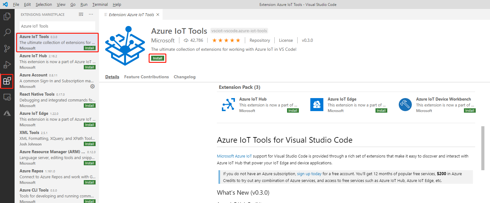
  
  The `Azure` module appears on the left if the installation is successful.
  
  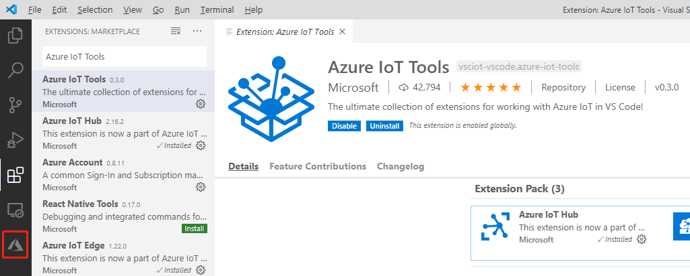
  
  Choose **Explorer > AZURE IOT HUB** to expand `AZURE IOT HUB`.
  
  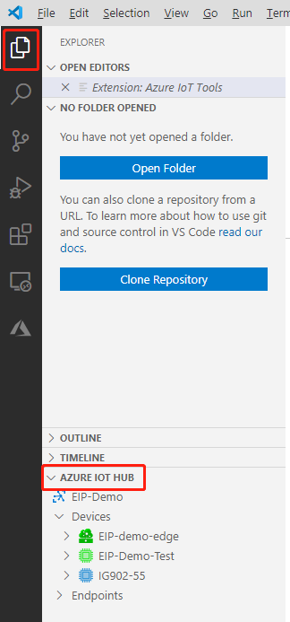
  
  Click **...** and choose **Set IoT Hub Connection String**.
  
  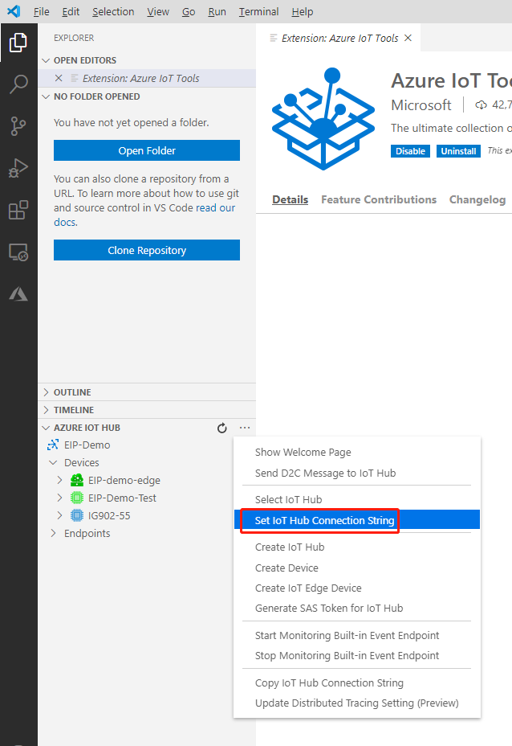
  
  Enter the IoT Hub connection string in the text box. You can go to the specified IoT Hub and choose **Shared access policies > iothubowner** to obtain the IoT Hub connection string.
  
  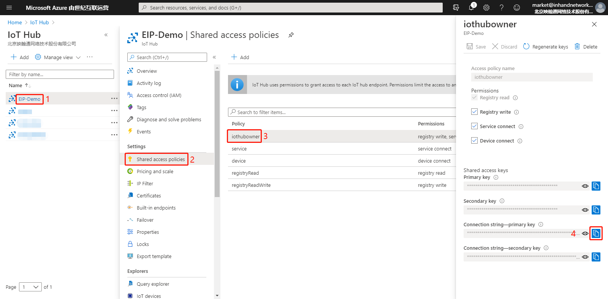
  
  
  
  Enter the connection string and press Enter. The created Azure IoT device and its connection status are displayed under **AZURE IOT HUB**.
  
  

- Step 3: View the messages that IG902 uploads to the Azure IoT.
  
  Right-click the Azure IoT device and choose `Start Monitoring Built-in Event Endpoint` to view the data that IG902 pushes to the IoT Hub.
  
  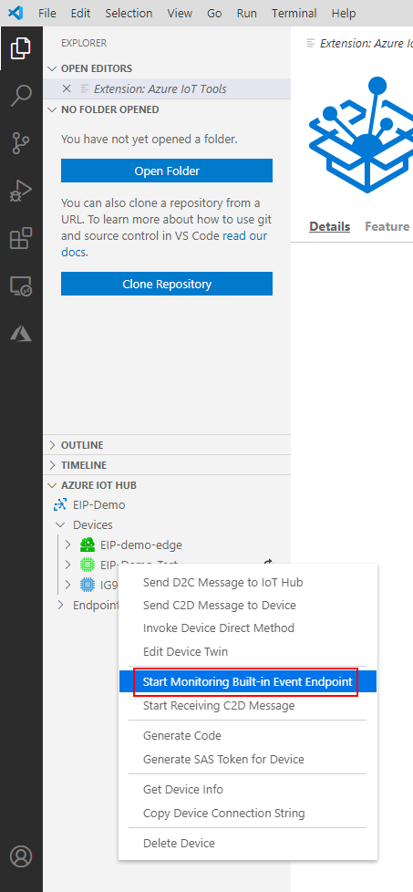
  
  The message content received by the IoT Hub is displayed on the **OUTPUT** tab page.
  
  

<a id="subscrip-azure-iot"> </a>

### 2.3 Subscribing to Azure IoT Messages

- Step 1: Configure the message for subscription.
  
  Choose **Cloud > Message Management** and add the message for subscription. The following figure shows the configuration:
  
  
  
  ```python
  import logging
  import json
  def ctl_test(message, wizard_api):
      logging.info(message.data) # Print the subscription data. Assume that the payload data is {"method":"setValue", "TagName":"SP1", "TagValue":12.3}.
      payload = json.loads(message.data) # Deserialize subscription data.
      if payload["method"] == "setValue": # Check whether the data is written.
          message = {payload["TagName"]:payload["TagValue"]} # Define the message to be delivered, including the variable names and values to be delivered.
          wizard_api.write_plc_values(message) # Call the write_plc_values method of the wizard_api module to deliver data from the message dictionary to the specified variable.
  ```
  
  The message subscription parameters are described as follows:
  
  - `Name`: custom subscription name.
  - `Main Function`: name of the main function (entry function), which must be consistent with that in the script.
  - `Script`: uses Python code to customize the packaging and processing logic. The main function parameters are as follows:
    - `Parameter 1`: message class sent by Azure IoT. The `data` and `custom_properties` methods are supported. For details, see [Example of Subscribing to Azure IoT Messages](#sample-subscription-to-azure-iot-messages).
    - `Parameter 2`: Azure IoT API of the Device Supervisor. For details, see [Device Supervisor Azure IoT API Description](#azure-iot-api-interface-description-of-device-supervisor).

- Step 2: Use the Azure IoT Tools plug-in of the Visual Studio Code (VS Code for short) to establish the connection to the IoT Hub.
  
  Same as [Step 2 of “Publishing Messages to the Azure IoT”](#connection-with-iot-hub).

- Step 3: Use the Azure IoT Tools to send data to IG902.
  
  Right-click the Azure IoT device and choose `Send C2D Message to Device` to send the data to IG902.
  
  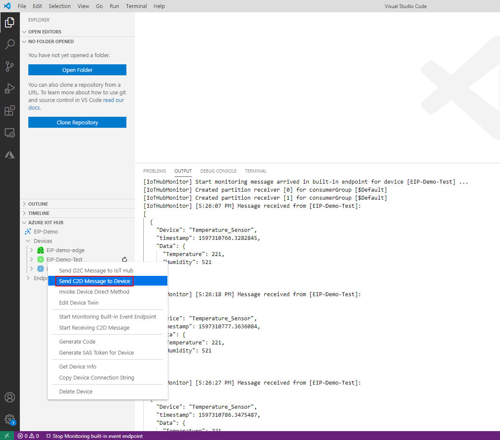
  
  Enter the data to be sent, for example, `{"method":"setValue", "TagName":"Temperature", "TagValue":123}`.
  
  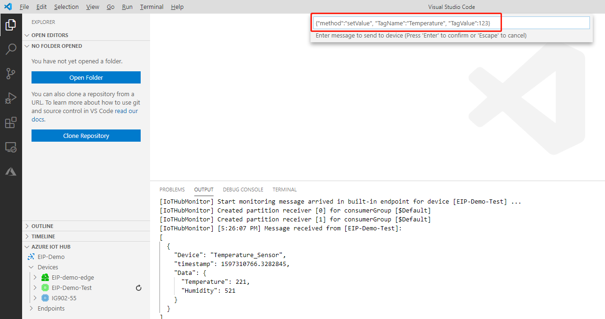
  
  Press Enter to send the data. Then, the success log is displayed on the **OUTPUT** tab page, and the value of the `Temperature` variable is changed to 123 on the **Device List** page.
  
  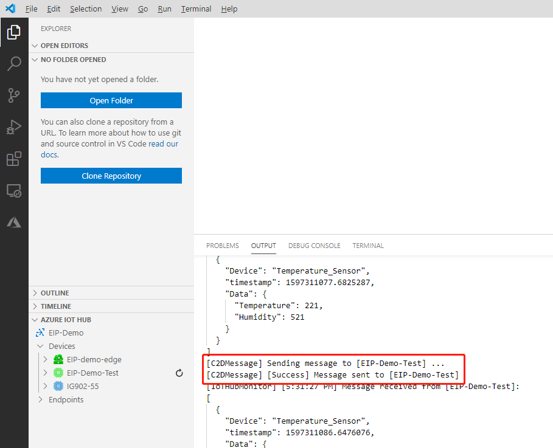
  
  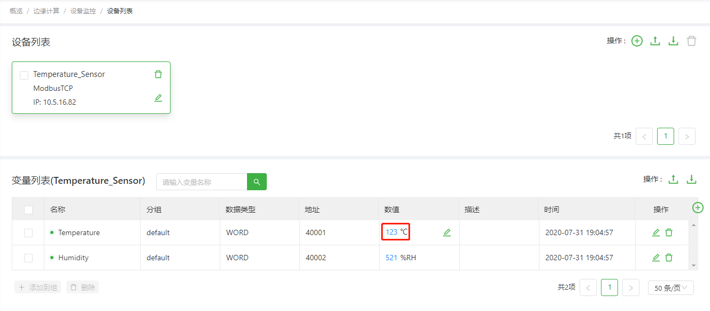

Service data submitting and configuration data delivery between the Device Supervisor and the Azure IoT are completed.

<a id="appendix"> </a>

## Appendix

- [Example of Publishing Messages to the Azure IoT](#publish-azure-iot-message-example)
- [Example of Subscribing to Azure IoT Messages](#sample-subscription-to-azure-iot-messages)
- [Device Supervisor Azure IoT API Description](#azure-iot-api-interface-description-of-device-supervisor)

<a id="publish-azure-iot-message-example"> </a>

### Example of Publishing Messages to the Azure IoT

- Publication example 1: using return to publish user data and property data
  
  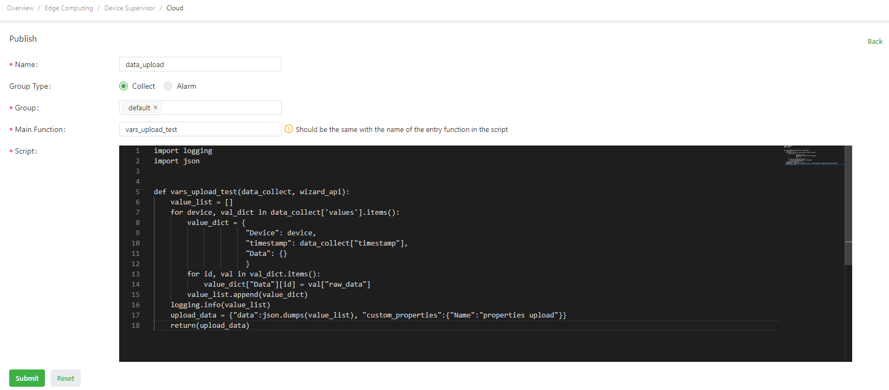
  
  ```python
  import logging
  import json
  """
  Logs are generally generated in the gateway in the following ways:
  1. import logging: uses logging.info(XXX) to generate logs. Display of logs generated in this way is not controlled by the log level parameter on the global parameter page.
  2. from common.Logger import logger: uses logger.info(XXX) to generate logs. Display of logs generated in this way is controlled by the log level parameter on the global parameter page.
  """
  
  def vars_upload_test(data_collect, wizard_api): # Define the main publishing function.
      value_list = [] # Define the data list.
      for device, val_dict in data_collect['values'].items(): # Traverse the values dictionary. The dictionary contains the device name and the variables of the device.
          value_dict = { # Customize the user data dictionary.
                        "Device": device,
                        "timestamp": data_collect["timestamp"],
                        "Data": {}
                        }
          for id, val in val_dict.items(): # Traverse variables and assign values for the Data dictionary.
              value_dict["Data"][id] = val["raw_data"]
          value_list.append(value_dict) # Add data in value_dict to value_list in sequence.
      logging.info(value_list) # Print data in value_list in app logs in the following format: [{'Device': 'S7-1200', 'timestamp': 1589538347.5604711, 'Data': {'Test1': False, 'Test2': 12}}].
      upload_data = {"data":json.dumps(value_list), "custom_properties":{"Name":"properties upload"}} # Define submitted data with the data type of dictionary. The user data is the value of “data”, the data type is string, the property data is the value of “custom_properties”, and the data type is dictionary.
      return(upload_data) # Send upload_data to the app, which then uploads it to the Azure IoT by collection time. If it fails to be sent, the data is cached and uploaded to the Azure IoT by collection time after the connection recovers.
  ```

<a id="save-data"> </a>

- Publication example 2: using `send_message_to_cloud` to send user data and using `save_data` to store the variables that fail to upload
  
  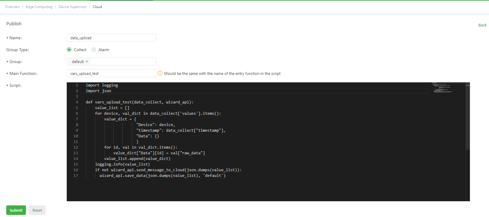
  
  ```python
  import logging
  import json
  """
  Logs are generally generated in the gateway in the following ways:
  1. import logging: uses logging.info(XXX) to generate logs. Display of logs generated in this way is not controlled by the log level parameter on the global parameter page.
  2. from common.Logger import logger: uses logger.info(XXX) to generate logs. Display of logs generated in this way is controlled by the log level parameter on the global parameter page.
  """
  
  def vars_upload_test(data_collect, wizard_api): # Define the main publishing function.
      value_list = [] # Define the data list.
      for device, val_dict in data_collect['values'].items(): # Traverse the values dictionary. The dictionary contains the device name and the variables of the device.
          value_dict = { # Customize the user data dictionary.
                        "Device": device,
                        "timestamp": data_collect["timestamp"],
                        "Data": {}
                        }
          for id, val in val_dict.items(): # Traverse variables and assign values for the Data dictionary.
              value_dict["Data"][id] = val["raw_data"]
          value_list.append(value_dict) # Add data in value_dict to value_list in sequence.
      logging.info(value_list) # Print data in value_list in app logs in the following format: [{'Device': 'S7-1200', 'timestamp': 1589538347.5604711, 'Data': {'Test1': False, 'Test2': 12}}].
      if not wizard_api.send_message_to_cloud(json.dumps(value_list)): # Call the send_message_to_cloud method of the wizard_api module to send value_list to the Azure IoT and check whether it is successful.
        wizard_api.save_data(json.dumps(value_list), 'default') # If it fails to be sent, the data is stored and uploaded by time after the connection recovers.
  ```

<a id="sample-subscription-to-azure-iot-messages"> </a>

### Example of Subscribing to Azure IoT Messages

- Subscribing to user data
  
  The following is a configuration example:
  
  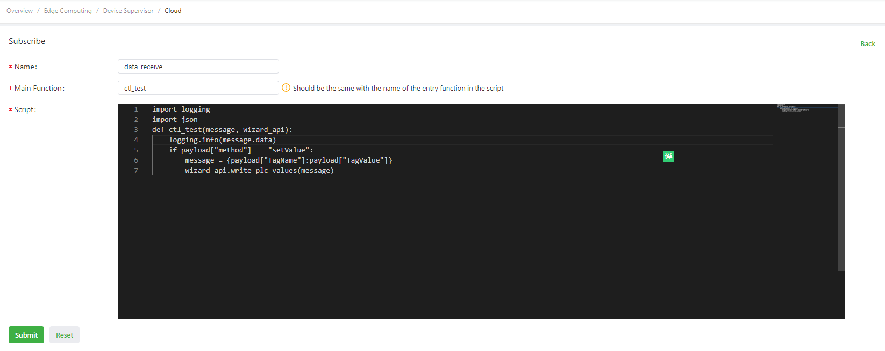
  
  The script is as follows:
  
  ```python
  import logging
  import json
  def ctl_test(message, wizard_api):
      logging.info(message.data) # Print the subscription data. Assume that the payload data is {"method":"setValue", "TagName":"SP1", "TagValue":12.3}.
      payload = json.loads(message.data) # Deserialize subscription data.
      if payload["method"] == "setValue": # Check whether the data is written.
          message = {payload["TagName"]:payload["TagValue"]} # Define the message to be delivered, including the variable names and values to be delivered.
          wizard_api.write_plc_values(message) # Call the write_plc_values method of the wizard_api module to deliver data from the message dictionary to the specified variable.
  ```

- Subscribing to property data
  
  The following is a configuration example:
  
  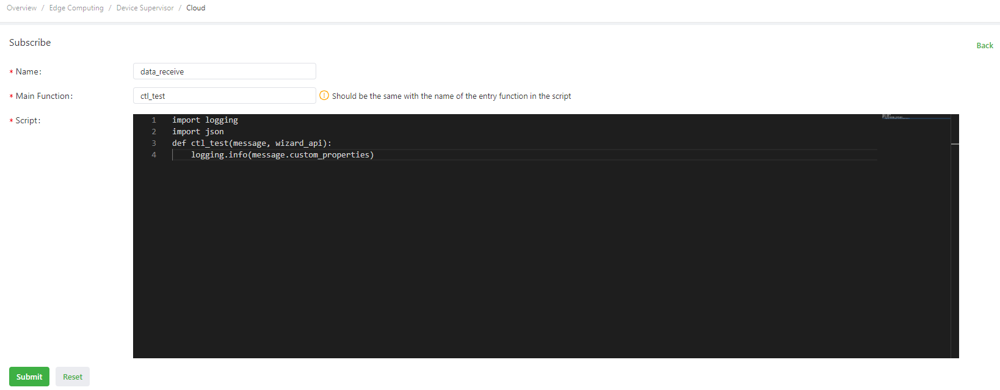
  
  The script is as follows:
  
  ```python
  import logging
  import json
  def ctl_test(message, wizard_api):
      logging.info(message.custom_properties) # Print the subscription data.
  ```

<a id="azure-iot-api-interface-description-of-device-supervisor"> </a>

### Device Supervisor Azure IoT API Description

For details about the basic `wizard_api` configuration, see [Device Supervisor API Description](http://app.ig.inhandnetworks.com/en/latest/Device-Supervisor-User-Manual-EN.html#device-supervisor-api-description). <font color=#FF0000>(Note: The data can be stored only through the group name. For details, see [Publication example 2](#save-data))</font>. If the cloud service type is `Azure IoT`, `wizard_api` additionally provides the following method:

- `send_message_to_cloud`
  - `Method Description`: data submitting method.
  - `Parameter`
    - `data`: user data to be submitted. <font color=#FF0000>This parameter cannot be left empty. The data type must be string, and the size of data submitted at a time cannot exceed 256 KB.</font>
    - `custom_properties`: property data to be submitted. <font color=#FF0000>The data type of property data must be dictionary, and the data type of values in the dictionary must be integer, floating-point number, or string. The size of data submitted at a time cannot exceed 81 KB.</font>
  - `Usage example`
    - Submitting user data
      
      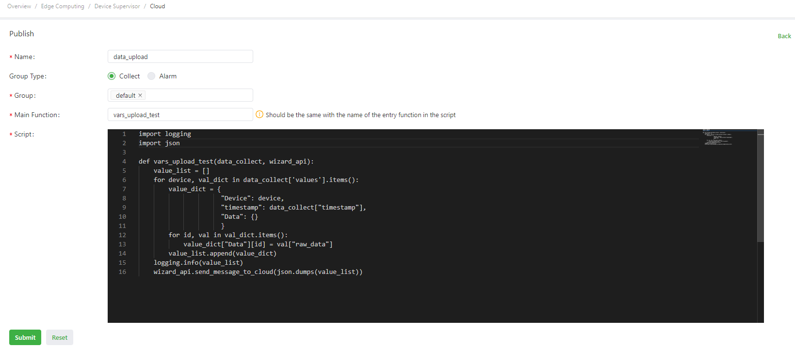
      
      ```python
      import logging
      import json
      """
      Logs are generally generated in the gateway in the following ways:
      1. import logging: uses logging.info(XXX) to generate logs. Display of logs generated in this way is not controlled by the log level parameter on the global parameter page.
      2. from common.Logger import logger: uses logger.info(XXX) to generate logs. Display of logs generated in this way is controlled by the log level parameter on the global parameter page.
      """
      
      def vars_upload_test(data_collect, wizard_api): # Define the main publishing function.
          value_list = [] # Define the data list.
          for device, val_dict in data_collect['values'].items(): # Traverse the values dictionary. The dictionary contains the device name and the variables of the device.
              value_dict = { # Customize the user data dictionary.
                            "Device": device,
                            "timestamp": data_collect["timestamp"],
                            "Data": {}
                            }
              for id, val in val_dict.items(): # Traverse variables and assign values for the Data dictionary.
                  value_dict["Data"][id] = val["raw_data"]
              value_list.append(value_dict) # Add data in value_dict to value_list in sequence.
          logging.info(value_list) # Print data in value_list in app logs in the following format: [{'Device': 'S7-1200', 'timestamp': 1589538347.5604711, 'Data': {'Test1': False, 'Test2': 12}}].
          wizard_api.send_message_to_cloud(json.dumps(value_list)) # Call the send_message_to_cloud method of the wizard_api module to send value_list (user data) to the Azure IoT.
      ```
    
    - Submitting property data
      
      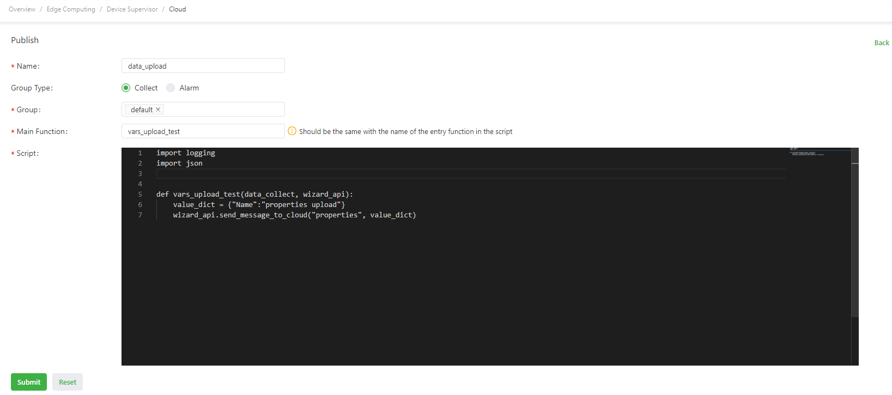
      
      ```python
      import logging
      import json
      """
      Logs are generally generated in the gateway in the following ways:
      1. import logging: uses logging.info(XXX) to generate logs. Display of logs generated in this way is not controlled by the log level parameter on the global parameter page.
      2. from common.Logger import logger: uses logger.info(XXX) to generate logs. Display of logs generated in this way is controlled by the log level parameter on the global parameter page.
      """
      
      def vars_upload_test(data_collect, wizard_api): # Define the main publishing function.
          value_dict = {"Name":"properties upload"} # Customize the property data dictionary.
          wizard_api.send_message_to_cloud("properties", value_dict) # Call the send_message_to_cloud method of the wizard_api module to send value_dict (property data) to the Azure IoT. Note: When property data is sent, parameter 1 cannot be left empty, and the data type must be string.
      ```

## FAQ

<a id="q1"> </a>

### Q1: The Azure IoT Connection Frequently Fails Shortly After It Is Established

A1: The run logs of the app contain `Paho returned rc==1`.

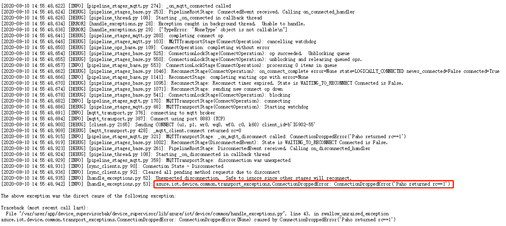

Log in to the Azure IoT, select the IoT devices related to the connection string, and choose **IoT Hub > IoT devices**. The message “You’ve reached your daily message quota, so you won’t be able to send new message or view device list” is displayed. If this occurs, wait until the daily message quota is available again, or increase the daily message quota.

