# Device Supervisor App User Manual

Device Supervisor App (Device Supervisor) allows users to collect and process data and upload data to the cloud conveniently and supports data parsing over multiple industrial protocols such as ISO on TCP and ModbusRTU. This manual takes collecting PLC data and uploading it to the ThingsBoard cloud platform as an example to describe how to collect PLC data and upload it to the cloud through Device Supervisor App. Hereinafter, InGateway501 is referred to as **IG501** and InGateway902 is referred to as **IG902**.

  - [Overview](#overview)
  - [](#prepare-hardware-equipment-and-its-data-collection-environment)
    - [1.1 Hardware wiring](#hardware-wiring)
      - [1.1.1 Ethernet wiring](#ethernet-wiring)
      - [1.1.2 Serial port wiring](#serial-wiring)
    - [1.2 Configure the LAN parameters to access PLC in a LAN](#set-lan-network-parameters)
    - [1.3 Configure the WAN parameters to transmit data to the MQTT server](#set-wan-network-parameters)
    - [1.4 Update the InGateway software version](#update-ingateway-device-software-version)
  - [2. Configure Device Supervisor App](#configuration_device_supervisor_app)
    - [2.1 Install and run Device Supervisor](#install_and_run_device_supervisor)
    - [2.2 Configure data collection for Device Supervisor](#device_supervisor-data-acquisition-configuration)
      - [2.2.1 Add a PLC](#add-plc-device)
      - [2.2.2 Add a variable](#add-variables)
      - [2.2.3 Configure an alarm policy](#configure-alarm-strategy)
      - [2.2.4 Configure a group](#configure-group)
  - [3. Monitor the PLC data](#monitor-plc-data)
    - [3.1 Monitor the PLC data locally](#local-monitor-plc-data)
      - [3.1.1 Monitor data collection locally](#local-monitoring-data-collection)
      - [3.1.2 Monitor the alarm locally](#local-monitoring-alarm)
    - [3.2 Monitor the PLC data on ThingsBoard](#monitor-plc-data-on-thingsboard)
      - [3.2.1 Configure ThingsBoard](#configure-thingsboard)
      - [3.2.2 Configure a cloud service](#configure-cloud-service)
  - [Appendix](#appendix)
    - [Importing/exporting configuration](#Importing_exporting_configuration)
    - [Advanced settings (custom MQTT publish/subscribe)](#advanced_settings_custom_MQTT_publish_subscribe)
      - [Publish](#publish)
      - [Subscribe](#subscribe)
      - [Device Supervisor API description](#device_supervisor_api_description)
      - [Callback function description](#callback-function-description)
    - [Global parameters](#global_parameters)
    - [Other gateway operations](#other_gateway_operations)
    - [ThingsBoard reference flowchart](#thingsBoard_reference_flowchart)
      - [Add devices and assets](#add_devices_and_assets)
      - [Transmit the PLC data to ThingsBoard devices](#transmit_the_plc_data_to_thingsBoard_devices)
      - [Configure a visual dashboard](#configure_a_visual_dashboard)
  - [FAQ](#faq)

<a id="overview"> </a>

## Overview

Prepare the following items:

- Edge computing gateway IG501/IG902
- PLC
- Network cable/serial port cable
- \*Firmware, SDKs, and apps required for software version update
  - Firmware version: V2.0.0.r12622 or later
  - SDK version: py3sdk-V1.3.7 or later
  - App version: 1.1.2 or later
- \*ThingsBoard demo account

The whole process is shown in the figure below:

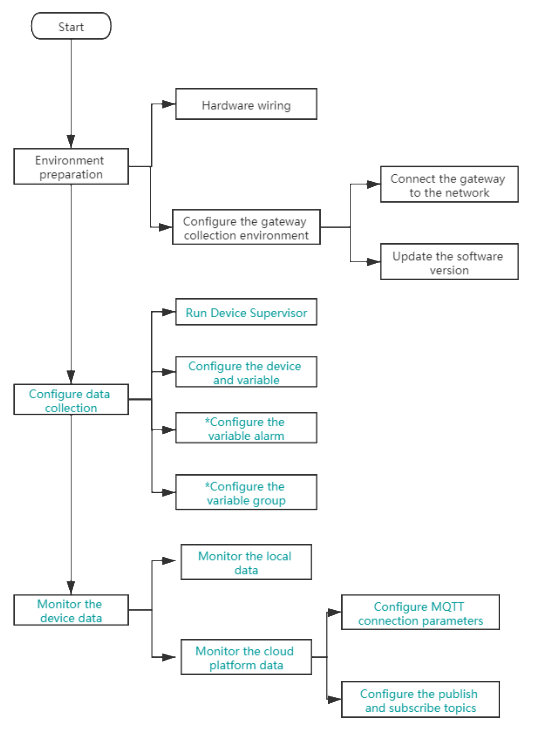

<a id="prepare-hardware-equipment-and-its-data-collection-environment"> </a>

## 1. Prepare the hardware and data collection environment

- [1.1 Hardware wiring](#hardware-wiring)
- [1.2 Configure the LAN parameters to access PLC in a LAN](#set-lan-network-parameters)
- [1.3 Configure the WAN parameters to transmit data to the MQTT server](#set-wan-network-parameters)
- [1.4 Update the InGateway software version](#update-ingateway-device-software-version)

<a id="hardware-wiring"> </a>

### 1.1 Hardware wiring

<a id="ethernet-wiring"> </a>

#### 1.1.1 Ethernet wiring

- Ethernet wiring for IG902
  
  Power on IG902 and connect IG902 and the PLC through an Ethernet cable according to the topology.
  
  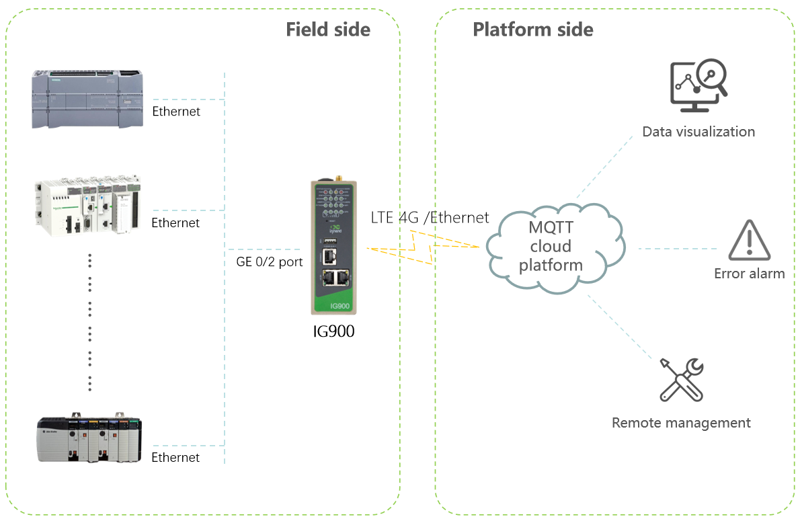

- Ethernet wiring for IG501
  
  Power on IG501 and connect IG501 and the PLC through an Ethernet cable according to the topology.
  
  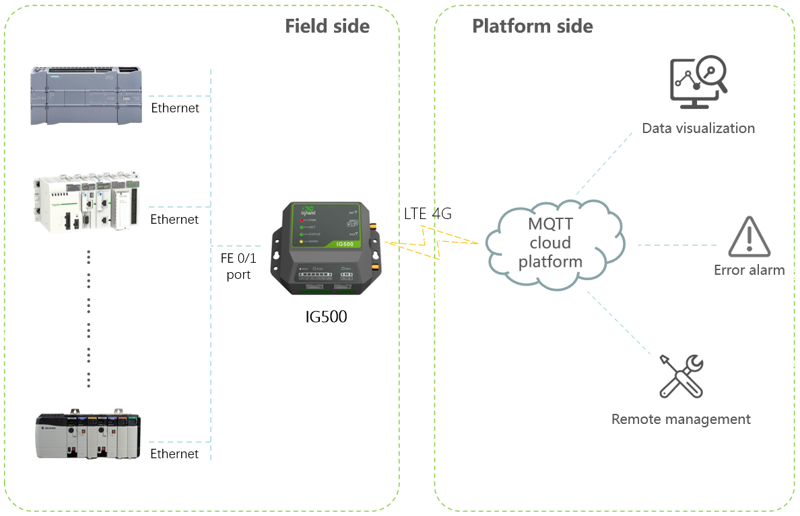

<a id="serial-wiring"> </a>

#### 1.1.2 Serial port wiring

- Serial port wiring for IG902
  
  Power on IG902 and connect IG902 and the PLC according to the topology.
  
  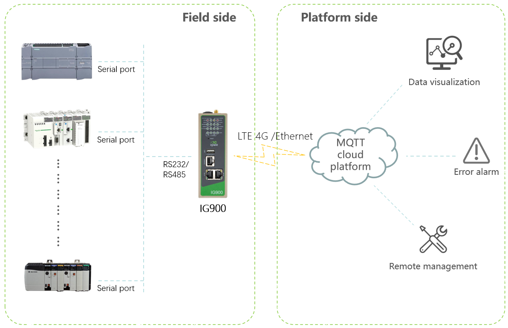
  
  The following figure describes how to connect serial port terminals of IG902:
  
  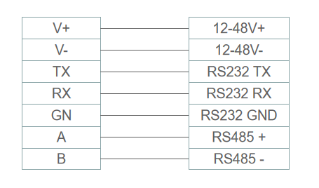

- Serial port wiring for IG501
  
  Power on IG501 and connect IG501 and the PLC according to the topology.
  
  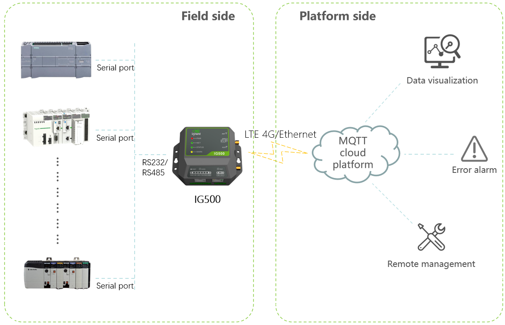
  
  The following figure describes how to connect serial port terminals of IG501:
  
  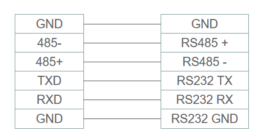

<a id="set-lan-network-parameters"> </a>

### 1.2 Configure the LAN parameters to access PLC in a LAN

- The default IP address of IG902's GE 0/2 port is `192.168.2.1`. To enable IG902 to access the Ethernet-based PLC over the GE 0/2 port, you need to set the GE 0/2 port to be in the same network segment of the PLC. For more information about the setting method, see [Access IG902 in a LAN.](http://fw.ig.inhandnetworks.com/en/latest/IG902-Quick-Start-Manual.html#set-lan-parameters-access-the-ig902-through-lan)
- The default IP address of IG501's FE 0/1 port is `192.168.1.1`. To enable IG501 to access the Ethernet-based PLC over the FE 0/1 port, you need to set the FE 0/1 port to be in the same network segment of the PLC. For more information about the setting method, see [Access IG501 in a LAN.](http://fw.ig.inhandnetworks.com/en/latest/IG501-Quick-Start-Manual.html#set-lan-parameters-access-the-ig501-through-lan)

<a id="set-wan-network-parameters"> </a>

### 1.3 Configure the WAN parameters to transmit data to the MQTT server

- Configure the IG902 WAN parameters by referring to [Connect IG902 to the Internet](http://fw.ig.inhandnetworks.com/en/latest/IG902-Quick-Start-Manual.html#set-wan-parameters-connect-ig902-to-the-internet).
- Configure the IG501 WAN parameters by referring to [Connect IG501 to the Internet](http://fw.ig.inhandnetworks.com/en/latest/IG501-Quick-Start-Manual.html#set-wan-parameters-connect-ig501-to-the-internet).

<a id="update-ingateway-device-software-version"> </a>

### 1.4 Update the InGateway software version

If you want to get the latest InGateway and its functional characteristics, contact Customer Services. To update the software version, see the following links:

- [Update the IG902 software version](http://fw.ig.inhandnetworks.com/en/latest/IG902-Quick-Start-Manual.html#update-the-software) To use Device Supervisor, IG902's firmware version must be `V2.0.0.r12537` or later, and the SDK version must be `py3sdk-V1.3.5` or later.
- [Update the IG501 software version](http://fw.ig.inhandnetworks.com/en/latest/IG501-Quick-Start-Manual.html#update-the-software)

<a id="configuration_device_supervisor_app"> </a>

## 2. Configure Device Supervisor App

- [2.1 Install and run Device Supervisor](#install_and_run_device_supervisor)
- [2.2 Configure data collection for Device Supervisor](#device_supervisor-data-acquisition-configuration)

<a id="install_and_run_device_supervisor"> </a>

### 2.1 Install and run Device Supervisor

- Install and run Python apps on IG902 by referring to [Install and run Python apps on IG902](https://ingateway-development-docs.readthedocs.io/zh_CN/latest/IG902%E5%BF%AB%E9%80%9F%E4%BD%BF%E7%94%A8%E6%89%8B%E5%86%8C.html#python-app). After Device Supervisor runs normally, the following figure is displayed:
  
  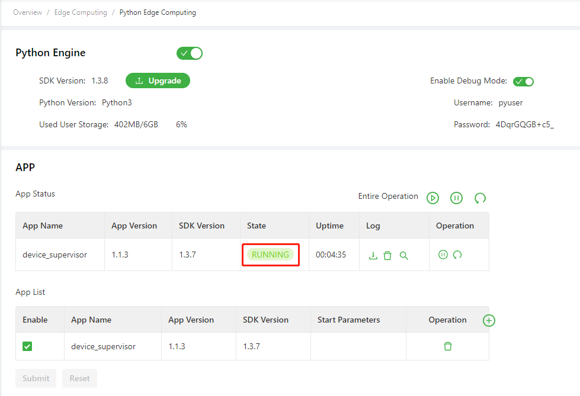

- Install and run Python apps on IG501 by referring to [Install and run Python apps on IG501](https://ingateway-development-docs.readthedocs.io/zh_CN/latest/IG501%E5%BF%AB%E9%80%9F%E4%BD%BF%E7%94%A8%E6%89%8B%E5%86%8C.html#python-app). After Device Supervisor runs normally, the following figure is displayed:
  
  

<a id="device_supervisor-data-acquisition-configuration"> </a>

### 2.2 Configure data collection for Device Supervisor

- [2.2.1 Add a PLC](#add-plc-device)
- [2.2.2 Add a variable](#add-variables)
- [2.2.3 Configure an alarm policy](#configure-alarm-strategy)
- [2.2.4 Configure a group](#configure-group)

<a id="add-plc-device"> </a>

#### 2.2.1 Add a PLC

- Add a PLC that communicates over ISO on TCP
  
  Choose **Edge Computing > Device Supervisor > Device List**, and click **Add** PLC. On the device adding page, select **ISO on TCP** as the PLC protocol and configure the PLC communication parameters.<font color=#FF0000> Note: The device name must be unique.</font>
  
  The following are examples of adding PLCs S7-1500, S7-1200, S7-400, S7-300, and S7-200 Smart (the mode is `Rack/Slot`). When the PLC S7-200 Smart is added, configure the rack number and slot number to 0 and 1 respectively. For other S7 series PLCs, use the default values 0 and 0 respectively.
  
  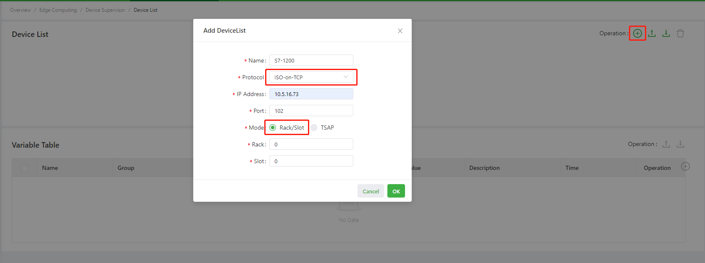
  
  The following are examples of adding S7-200 and Siemens LOGO series PLCs (the mode is `TSAP`):
  
  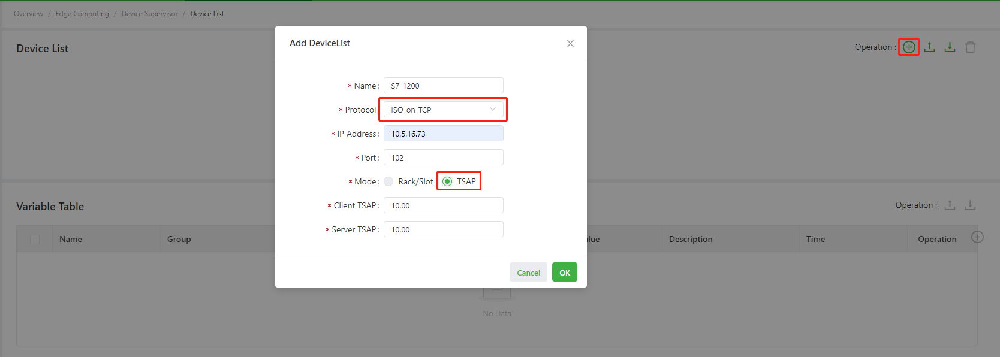
  
  After the PLC is added, the page is as follows:
  
  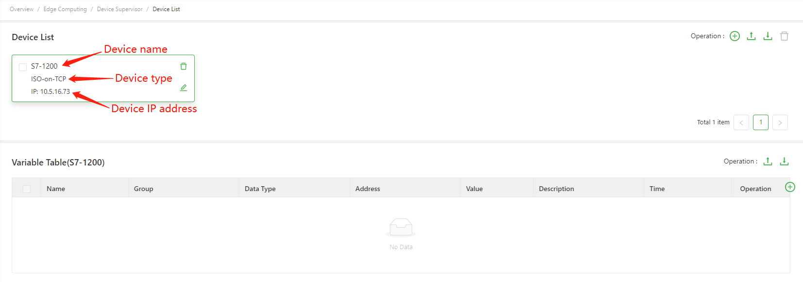

- Add a PLC that communicates over ModbusTCP
  
  Choose **Edge Computing > Device Supervisor > Device List**, and click **Add** PLC. On the device adding page, select **ModbusTCP** as the PLC protocol and configure the PLC communication parameters. (The default port number and byte order are 502 and abcd respectively. Adjust them as needed.) <font color=#FF0000>Note: The device name must be unique.</font>
  
  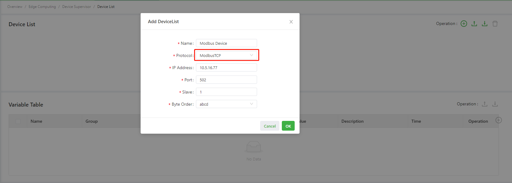
  
  After the PLC is added, the page is as follows:
  
  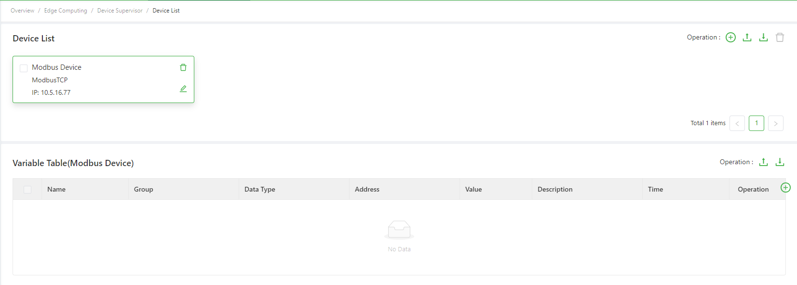

- Add a PLC that communicates over ModbusRTU
  
  Choose **Edge Computing > Device Supervisor > Device List**, and click **Add** PLC. On the device adding page, select ModbusRTU as the PLC protocol and configure the PLC communication parameters. Note: The device name must be unique.</font>
  
  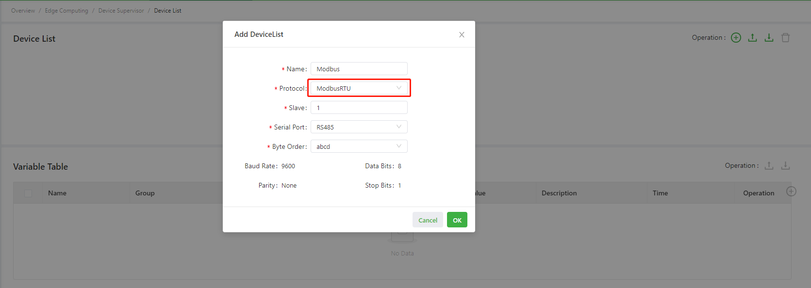
  
  After the PLC is added, the page is as follows:
  
  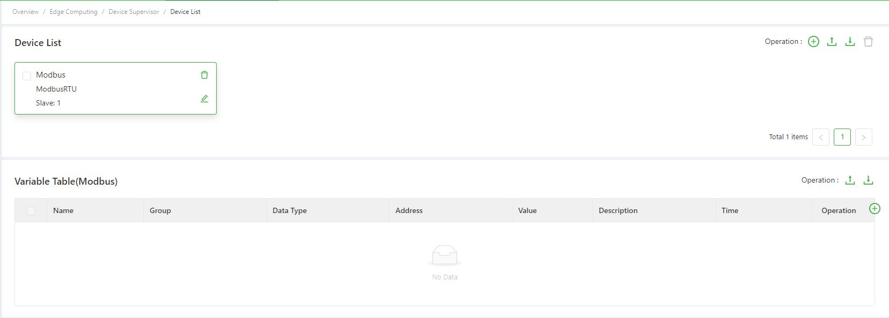
  
  To modify communication parameters for the RS232/RS485 serial port, choose **Edge Computing > Device Supervisor > Global Parameters**, and modify them on the page. After modification, communication parameters of all serial ports are automatically updated to the modified ones.
  
  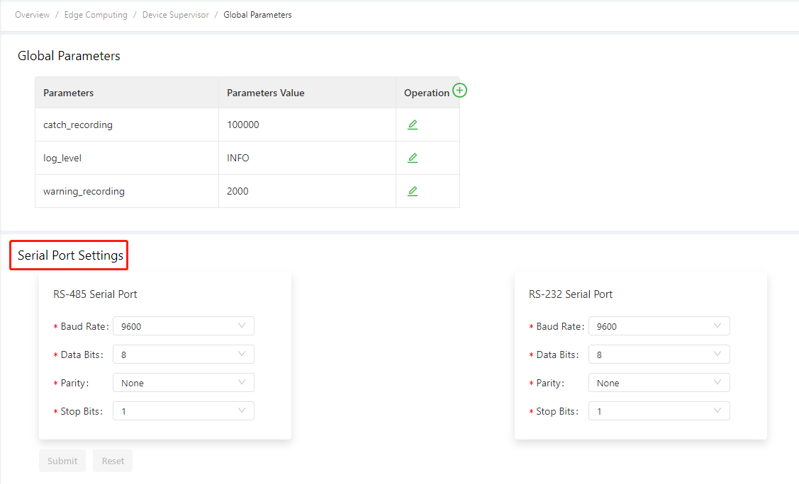

<a id="add-variables"> </a>

#### 2.2.2 Add a variable

- Add the ISO on TCP variable
  
  On the **Device List** page, click **Add** variable, and configure the variable parameters in the pop-up box.
  
  - `Variable Name`: The variable name. <font color=#FF0000>(The variable name must be unique in the same device.)</font>
  - `Register Type`: The variable register type. Four types are supported: `I/Q/M/DB`.
  - `DB Number`: The variable DB number when the register type is DB.
  - `Register Address`: The variable register address.
  - `Data Type`: The variable data type, including:
    - `BOOL`: True or False.
    - `BIT`: 0 or 1.
    - `BYTE`: An 8-bit unsigned character.
    - `SINT`: An 8-bit signed character.
    - `WORD`: A 16-bit unsigned character.
    - `INT`: A 16-bit signed character.
    - `DWORD`: A 32-bit unsigned character.
    - `DINT`: A 32-bit signed character.
    - `FLOAT`: A 32-bit floating point.
    - `STRING`: An 8-bit string.
    - `BCD`: A 16-bit BCD code.
  - `Decimal Places`: The number of decimal places of the variable when the data type is FLOAT. The maximum value is 6.
  - `Size`: The length of one read string is 1 when the data type is STRING.
  - `Register Bit`: The bit offset of the variable when the data type is BOOL or BIT. Any integer from 0 to 7 is supported.
  - `Read/Write`:
    - `Read`: Read only.
    - `Write`: Write only.
    - `Read/Write`: Read and write.
  - `Mode`:
    - `Realtime`: Collect the variable data at the collection interval of the group it belongs and report the data at the report interval.
    - `Onchange`: Collect the variable data only when the data changes and report the data at the report interval.
  - `Unit`: The variable unit.
  - `Description`: The variable description.
  - `Group`: The collection group to which the variable belongs.
  
  The following figure is an example of adding a switch variable with the address %I0.0:
  
  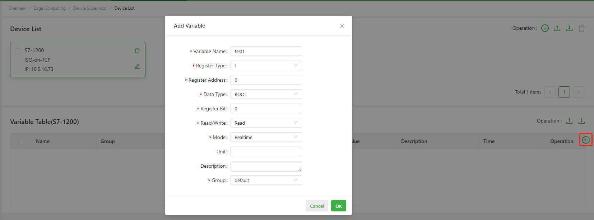
  
  The following figure is an example of adding a byte variable with the address %IB1:
  
  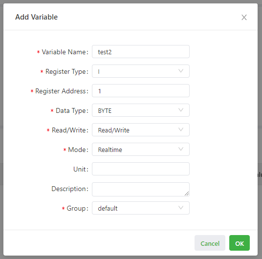
  
  The following figure is an example of adding a word variable with the address %IW3:
  
  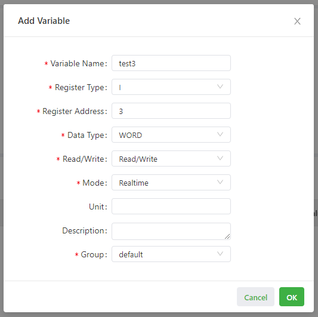
  
  The following figure is an example of adding a dual-word variable with the address %ID4:
  
  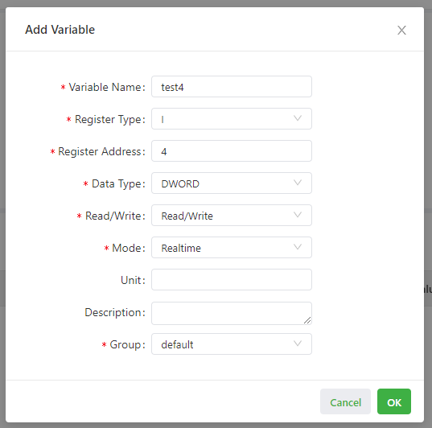
  
  The following figure is an example of adding a floating point variable with the address %DB6.DBD18:
  
  

- Add the Modbus variable
  
  On the **Device List** page, click **Add** variable, and configure the variable parameters in the pop-up box for adding variables.
  
  - `Variable Name`: The variable name. <font color=#FF0000>(The variable name must be unique in the same device.)</font>
  - `Register Address`: The variable register address.
  - `Data Type`: The variable data type, including:
    - `BOOL`: True or False.
    - `BIT`: 0 or 1.
    - `WORD`: A 16-bit unsigned character.
    - `INT`: A 16-bit signed character.
    - `DWORD`: A 32-bit unsigned character.
    - `DINT`: A 32-bit signed character.
    - `FLOAT`: A 32-bit floating point.
    - `STRING`: An 8-bit string.
  - `Decimal Places`: The number of decimal places of the variable when the data type is FLOAT. The maximum value is 6.
  - `Size`: The string length when the data type is STRING.
  - `Register Bit`: The bit offset of the variable when the address is `30001~40000`, `310001~365535`, `40001~50000`, and `410001~465535` and the data type is BOOL or BIT. Any integer from 0 to 15 is supported.
  - `Read/write`:
    - `Read`: Read only.
    - `Write`: Write only.
    - `Read/Write`: Read and write.
  - `Mode`:
    - `Realtime`: Collect the variable data at the collection interval of the group it belongs and report the data at the report interval.
    - `Onchange`: Collect the variable data only when the data changes and report the data at the report interval.
  - `Unit`: The variable unit.
  - `Description`: The variable description.
  - `Group`: The collection group to which the variable belongs.
  
  The following figure is an example of adding a coil variable with the address 00001:
  
  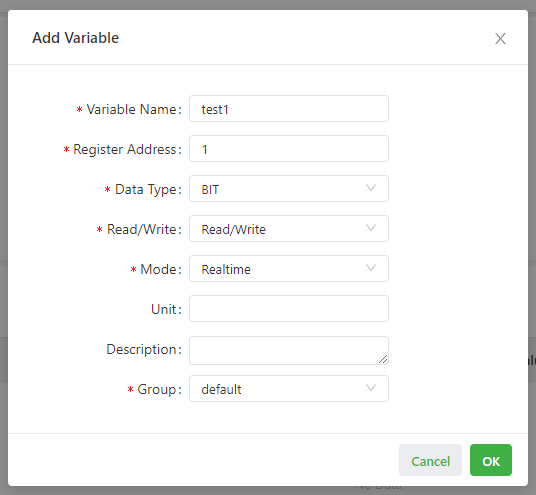
  
  The following figure is an example of adding a switch variable with the address 10001:
  
  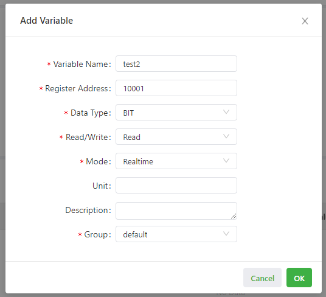
  
  The following figure is an example of adding an integer variable with the address 30001:
  
  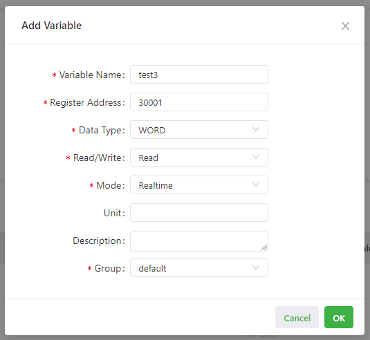
  
  The following figure is an example of adding a floating point variable with the address 40001:
  
  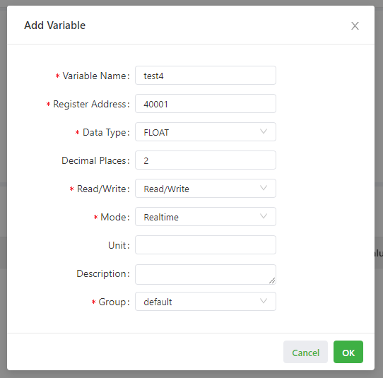

<a id="configure-alarm-strategy"> </a>

#### 2.2.3 Configure an alarm policy

Choose **Edge Computing > Device Supervisor > Alarm > Alarm Strategy**, click **Add**, and configure the alarm policy parameters in the pop-up box. You can configure the alarm policy in two modes: **Use New Variable** and **Use Exist Variable**. The parameters are described as follows:

- Use New Variable
  
  - `Name`: The alarm name.
  - `Group`: The alarm group.
  - `Mode`: In Use New Variable mode, the alarm variable is not configured in the Device List. You need to configure the variable parameters, which does not add a new variable to the Device List.
  - `Device`: The device of the alarm variable.
  - `Register Type`: The variable register type. Four types are supported: `I/Q/M/DB`.(ISO on TCP variable)
  - `Register Address`: The address of the alarm variable.
  - `Data Type`: The data type of the alarm variable.
  - `Alarm Condition`
    - `Judgment Conditions`: Valid values are =, !=, >, ≥, \<, and ≤.
    - `Logical Condition`
      - `None`: Judge the alarm based on a single judgment condition.
      - `&&`: Judge the alarm based on two single judgment conditions in AND mode.
      - `||`: Judge the alarm based on two single judgment conditions in OR mode.
  - `Description`: The alarm description.
  
  The following figure is an example of adding an alarm variable. When its value is greater than 30 but less than 50, the alarm is triggered; otherwise, the alarm is not triggered or is cleared.
  
  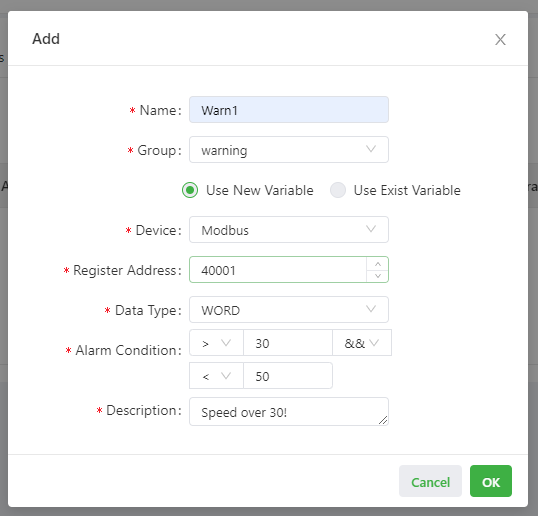

- Use Exist Variable
  
  - `Name`: The alarm name.
  - `Group`: The alarm group.
  - `Mode`: In Use Existing Variable mode, the alarm variable is already configured in the Device List. You can enter the variable name and use it directly.
  - `Device`: The device of the alarm variable.
  - `Variable Name`: The name of referenced variable.
  - `Alarm Condition`
    - `Judgment Conditions`: Valid values are =, !=, >, ≥, \<, and ≤.
    - `Logical Condition`
      - `None`: Judge the alarm based on a single judgment condition.
      - `&&`: Judge the alarm based on two single judgment conditions in AND mode.
      - `||`: Judge the alarm based on two single judgment conditions in OR mode.
  - `Description`: The alarm description.
  
  The following figure is an example of using an existing variable to generate an alarm variable. When its value is greater than 30 but less than 50, the alarm is triggered; otherwise, the alarm is not triggered or is cleared.
  
  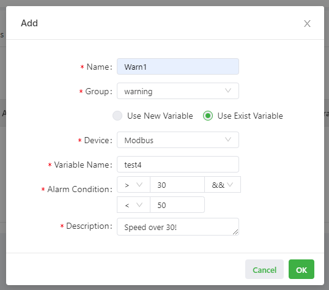

<a id="configure-group"> </a>

#### 2.2.4 Configure a group

To configure different collection intervals for a variable or an alarm or report the variable data by MQTT topic, choose **Edge Computing > Device Supervisor > Group**, and add a group on the page.

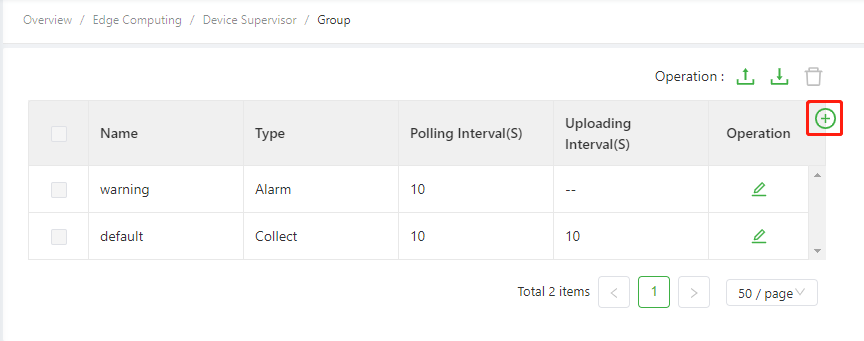

- Add a collection group
  
  The following figure is an example of adding a collection group named **group2**. Data of variables in this group is collected once every 5 seconds.
  
  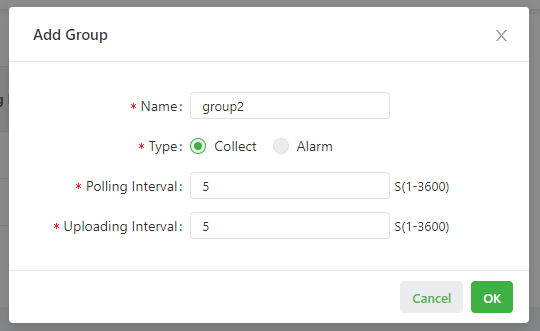
  
  After a collection group is added, you can associate the variable you added with the group or select the target variable from the variable list and add it to the specified group. Data of variables in the group is collected at the group's collection interval.
  
  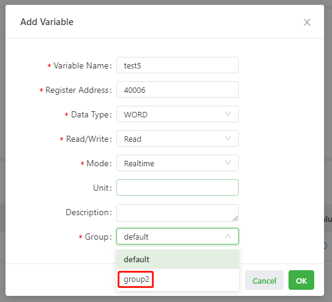
  
  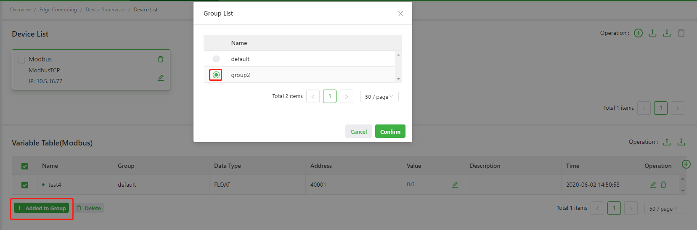

- Add an alarm group
  
  The following figure is an example of adding an alarm group named warn_group. The alarm group checks whether the alarm variables in the group are in alarm state once every 5 seconds.
  
  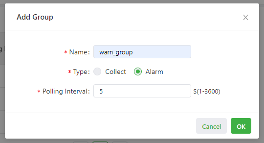
  
  After an alarm group is added, you can associate the alarm policy you added with the group or select the target alarm policy from the alarm list and add it to the specified group. The system checks the variable alarm state at the group's collection interval according to the alarm policies in the group.
  
  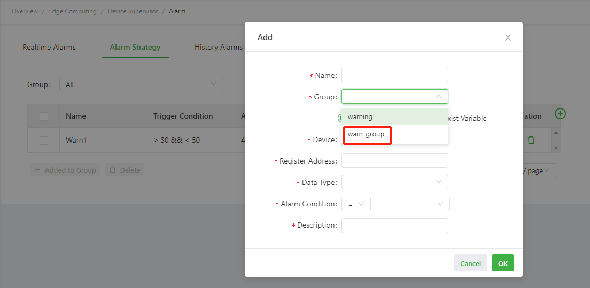
  
  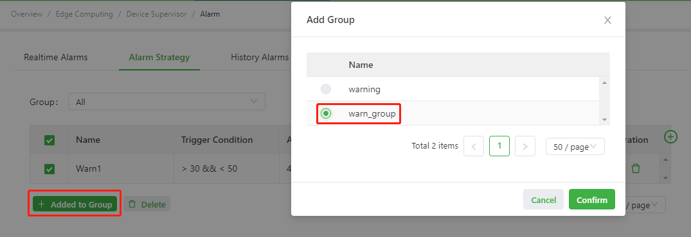

<a id="monitor-plc-data"> </a>

## 3. Monitor the PLC data

- [3.1 Monitor the PLC data locally](#local-monitor-plc-data)
- [3.2 Monitor the PLC data on ThingsBoard](#monitor-plc-data-on-thingsboard)

<a id="local-monitor-plc-data"> </a>

### 3.1 Monitor the PLC data locally

- [3.1.1 Monitor data collection locally](#local-monitoring-data-collection)
- [3.1.2 Monitor the alarm locally](#local-monitoring-alarm)

<a id="local-monitoring-data-collection"> </a>

#### 3.1.1 Monitor data collection locally

After configuring data collection, choose **Edge Computing > Device Supervisor > Device List**, and view the data collection status. Click the device card in Device List to switch to the desired PLC data.

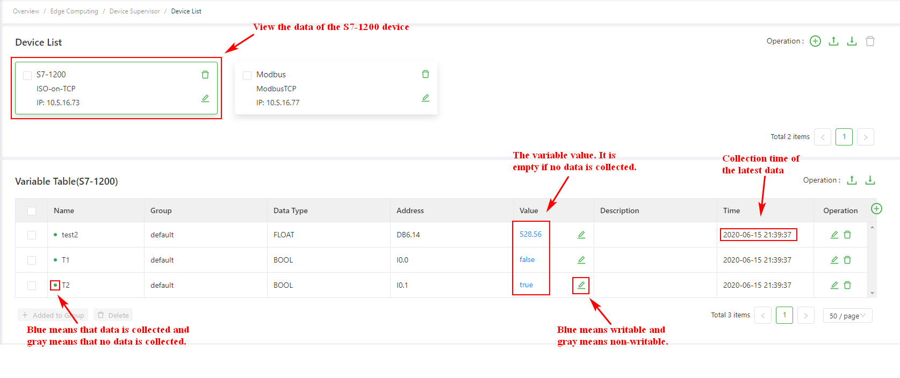

Click the button in the value column to write values.

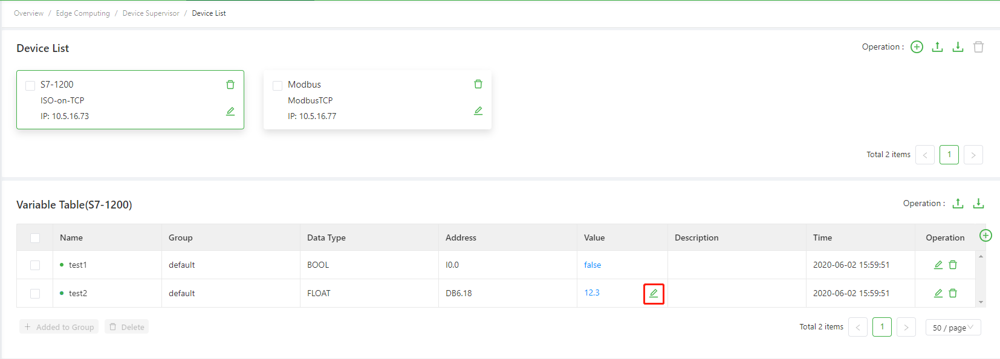

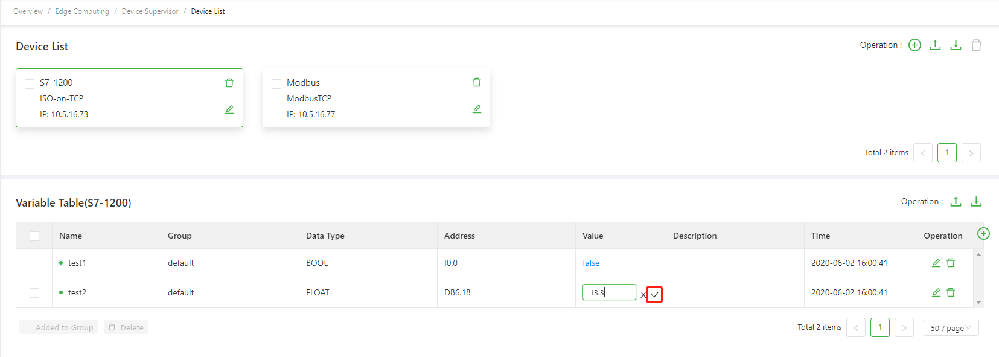

After the value is modified, the page is as follows:

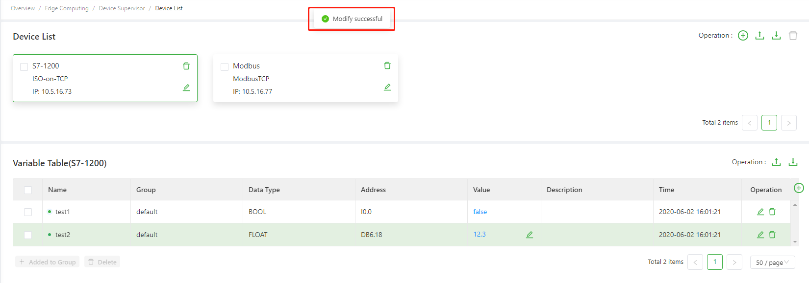

<a id="local-monitoring-alarm"> </a>

#### 3.1.2 Monitor the alarm locally

After configuring the alarm policy, choose **Edge Computing > Device Supervisor > Alarm**, and view the variable alarm status.

- Realtime Alarms: View alarm messages that are not cleared.
  
  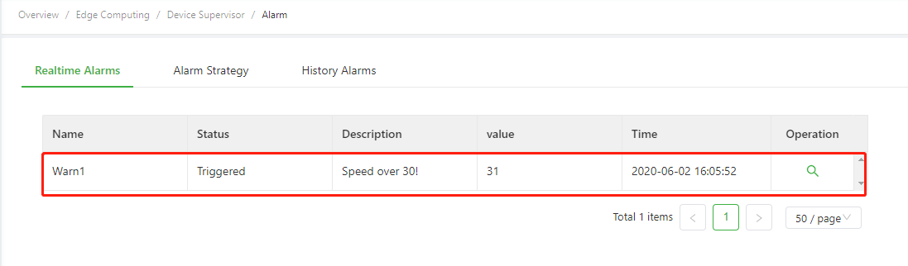

- History Alarms: Screen any alarm messages you want to view.
  
  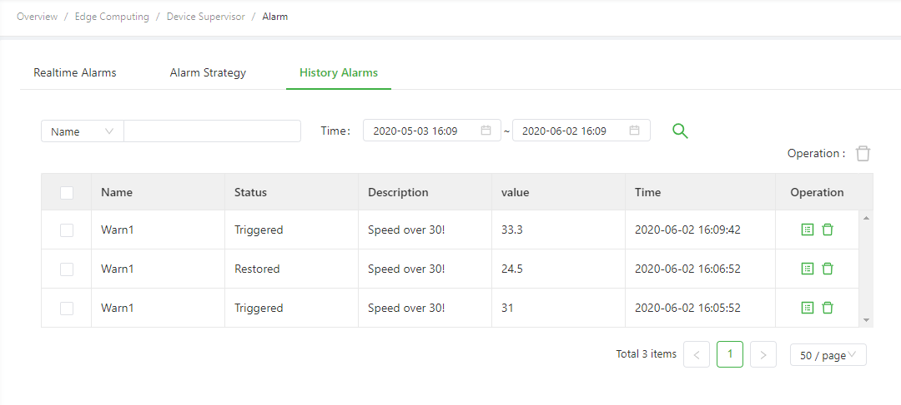

<a id="monitor-plc-data-on-thingsboard"> </a>

### 3.2 Monitor the PLC data on ThingsBoard

- [3.2.1 Configure ThingsBoard](#configure-thingsboard)
- [3.2.2 Configure cloud service](#configure-cloud-service)

<a id="configure-thingsboard"> </a>

#### 3.2.1 Configure ThingsBoard

For the usage method of ThingsBoard, see [Get Started with ThingsBoard](https://thingsboard.io/docs/getting-started-guides/helloworld/) or refer to [ThingsBoard Reference Flowchart](#thingsboard参考流程) for test.

<a id="configure-cloud-service"> </a>

#### 3.2.2 Configure a cloud service

Choose **Edge Computing > Device Supervisor > Cloud Service**. Select Enable Cloud Service, configure the MQTT connection parameters, and then click Submit.

- `Server Address`: The ThingsBoard demo address is `demo.thingsboard.io`.
- `Port`: The default value is `1883`.
- `Client ID`: Any unique ID.
- `Username`: The access token of the ThingsBoard device. For more information about how to obtain the access token, see [Transmit the PLC data to ThingsBoard.](#transmit_the_plc_data_to_thingsBoard_devices)
- `Password`: A password consisting of 6-32 bits.
- Use default values for other configuration items.

After the configuration is completed, the page is as follows:

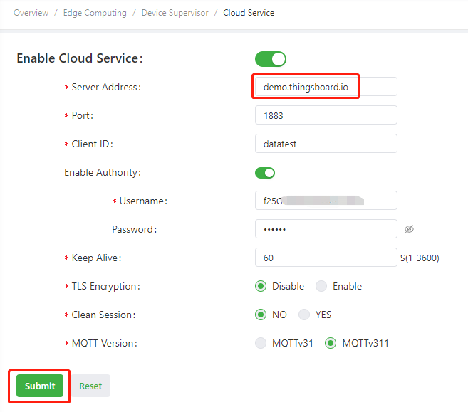

Then, click **Advanced Settings** to configure the publish and subscribe topics. For more information about how to configure the publish and subscribe topics, see [Advanced settings (custom MQTT publish/subscribe)](#advanced_settings_custom_MQTT_publish_subscribe) The following is a configuration example:

- Publish topic:
  
  - `Topic`: `v1/devices/me/telemetry`
  - `Qos(MQTT)`: `1`
  - `Group Type`: `Collect`
  - `Group`: The name of the group whose data needs to be uploaded to ThingsBoard. `default` is used in this manual.
  - `Main Function`: The name of the entry function. `upload_test` is used in this manual.
  - `Script`:
    ```python
    from common.Logger import logger #Import log printing module logger.
    
    def upload_test(data, wizard_api): #Define the main function upload_test.
        logger.info(data) #Print the collected data in logs of the INFO level.
        value_dict = {} #Define the report data dictionary value_dict.
        for device, val_dict in data['values'].items(): #Traverse the values dictionary in the data. The dictionary contains the device name and the variables of the device.
            for id, val in val_dict.items(): #Traverse variables and assign values for the value_dict dictionary.
                value_dict[id] = val["raw_data"]
            value_dict["timestamp"] = data["timestamp"]
        logger.info(value_dict) #Print data of the value_dict dictionary in logs of the INFO level.
        return value_dict #Send value_list to the app, which then sequential uploads it to the MQTT server. The value_list is finally in the following format: {'bool': False, 'byte': 7, 'real': 0.0, 'timestamp': 1583990892.5429199}.
    ```
  
  After the configuration is completed, the page is as follows:
  
  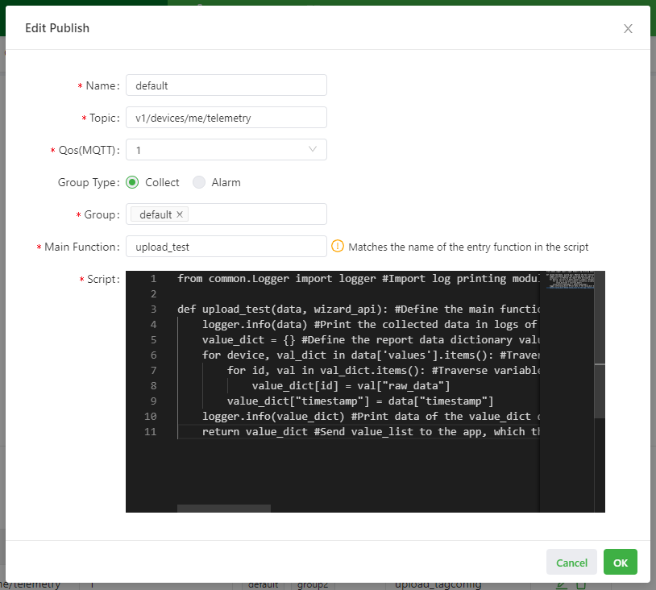

- Subscribe topic
  
  - `Topic`: `v1/devices/me/rpc/request/+`
  - `Qos(MQTT)`: `1`
  - `Main Function`: The name of the entry function. `ctl_test` is used in this manual.
  - `Script`:
    ```python
    from common.Logger import logger #Import log printing module logger.
    import json #Import the JSON module.
    
    def ctl_test(topic, payload, wizard_api): #Define the main function ctl_test.
        logger.info(topic) #Print the subscribe topic.
        logger.info(payload) #Print the subscribe data. ThingsBoard devices deliver data in the following format: {"method":"setValue","params":true}.
        payload = json.loads(payload) #Deserialize subscribe data.
        if payload["method"] == "setValue": #Check whether the data is written.
            message = {"bool":payload["params"]} #Define the message for modifying variables, including the variable names and values.
            ack_tail = [topic.replace('request', 'response'), message] #Define the confirmation data, including the response topic and message.
            wizard_api.write_plc_values(message, ack, ack_tail) #Call the write_plc_values method to deliver data from the message dictionary to the specified variable. Call the ack method and deliver ack_tail to the ack method.
    
    
    def ack(data, ack_tail, wizard_api): #Define the ack method.
        resp_topic = ack_tail[0] #Define the response topic.
        resp_data = ack_tail[1] #Define the response data.
        wizard_api.mqtt_publish(resp_topic, json.dumps(resp_data), 1) #Call the mqtt_publish method to deliver the response data to the MQTT server in {'bool': True} format.
    ```
  
  After the configuration is completed, the page is as follows:
  
  

<a id="appendix"> </a>

## Appendix

- [Importing/exporting configuration](#Importing_exporting_configuration)
- [Advanced settings (custom MQTT publish/subscribe)](#advanced_settings_custom_MQTT_publish_subscribe)
- [Global parameters](#global_parameters)
- [Other gateway operations](#other_gateway_operations)
- [ThingsBoard reference flowchart](#thingsBoard_reference_flowchart)

<a id="Importing_exporting_configuration"> </a>

### Importing/exporting configuration

Device Supervisor provides three CSV configuration files for data collection configuration. You can quickly configure data collection by importing or exporting configuration files. Each configuration file contains the following items:

- device.csv: The device configuration file, which contains the following parameters:
  
  - `Device Name`: The device name.
  - `Protocol`: The communication protocol, such as `ModbusTCP`.
  - `Ip/Serial`: Enter the IP address for Ethernet devices, and enter `RS485` or `RS232` for serial port devices.
  - `Port`: The communication port number of the Ethernet device.
  - `Rack` (Only ISO on TCP devices): The rack number of the device.
  - `Slot` (Only ISO on TCP devices): The slot number of the device.
  - `Mode` (Only ISO on TCP devices): The ISO on TCP mode. Valid values are `TSAP` and `Rack/Slot`.
  - `Slave` (Only Modbus devices): The address of the slave station.
  - `Byte Order` (Only Modbus devices): The byte order. Valid values are `abcd`, `badc`, `cdab`, and `dcba`.
  
  The export method is to export the device list on the **Device List** page.
  
  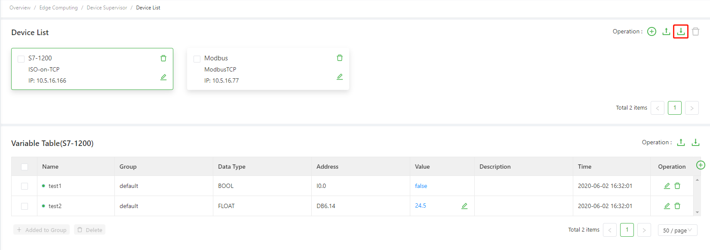
  
  The following is a configuration example:
  
  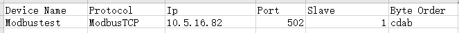

- var.csv: The variable configuration file, which contains the following parameters:
  
  - `Var Name`: The variable name.
  - `Device`: The device of the variable.
  - `Protocol`: The communication protocol.
  - `Dbnumber` (Only ISO on TCP devices): The DB number.
  - `Register Type` (Only ISO on TCP devices): The register type, such as `DB`.
  - `Register Addr`: The register address.
  - `Register Bit`: The bit offset.
  - `Data Type`: The data type.
  - `Read Write`: The read/write permission. Valid values are `Read/Write`, `Write`, and `Read`.
  - `Float Repr`: The number of decimal places. Valid values are `1~6`.
  - `Mode`: The collection mode. Valid values are `realtime` and `onchange`.
  - `Unit`: The unit.
  - `Size`: The string length.
  - `Desc`: The description.
  - `Group`: The group.
  
  The export method is to export the variable list on the **Device List** page.
  
  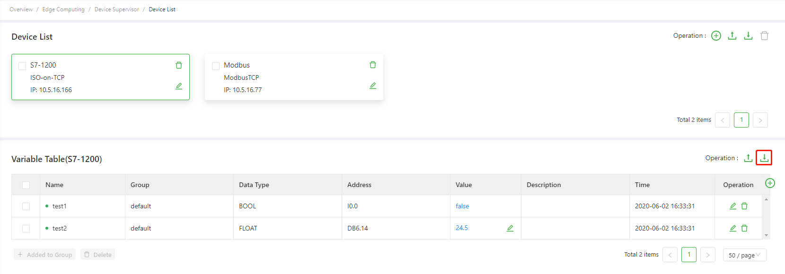
  
  The following is a configuration example:
  
  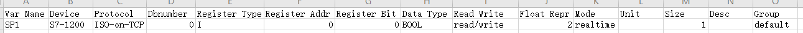

- group.csv: The group configuration file, which contains the following parameters:
  
  - `Group Name`: The group name.
  - `Polling Interval`: The collection interval.
  - `Upload Interval`: The upload interval. Left it empty when the group type is `alarm`.
  - `Group Type`: The group type. Valid values are `alarm` and `collect`.
  
  The export method is to export groups on the **Group** page.
  
  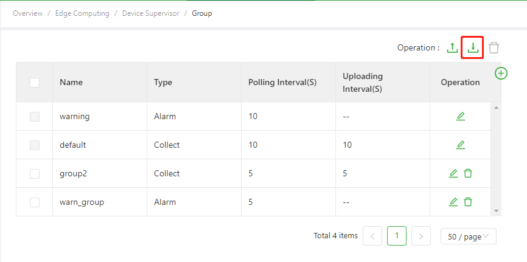
  
  The following is a configuration example:
  
  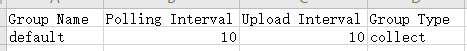

<a id="advanced_settings_custom_MQTT_publish_subscribe"> </a>

### Advanced settings (custom MQTT publish/subscribe)

You can choose **Edge Computing > Device Supervisor > Cloud Service** and configure MQTT connection parameters. You can configure the MQTT topic, data source, and other parameters for the data to be uploaded, and customize the data upload and processing logic for the MQTT publish and subscribe topics in Python. In this way, you can perform data upload and delivery with multiple types of MQTT servers without secondary development. The following describes how to use **Advanced Settings**.

- [Publish](#publish)
- [Subscribe](#subscribe)
- [Device Supervisor API description](#device_supervisor_api_description)
- [Callback function description](#callback-function-description)

<a id="publish"> </a>

#### Publish

To customize a publish topic, configure the following items:

- `Name`: The custom publish name.
- `Topic`: The publish topic, which must be consistent with the topic subscribed to by the MQTT server.
- `Qos(MQTT)`: The publish QoS, which is recommended to be consistent with that of the MQTT server.
  - `0`: The message is sent only once, without retry.
  - `1`: The message is sent at least once to ensure that it reaches the MQTT server.
  - `2`: Ensure that the message reaches the MQTT server and the MQTT server receives it only once.
- `Group Type`: When publishing variable data, select **Collect**, and then only **Collect Group** is available in `Group`. When publishing alarm data, select **Alarm**, and then only **Alarm Group** is available in `Group`.
- `Group`: After a group is selected, data of all variables in this group is uploaded to the MQTT server based on this publish configuration. You can select multiple groups.
- `Main Function`: The name of the main function (entry function), which must be consistent with that in the script.
- `Script`: Use the Python code to customize the packaging and processing logic. Main functions in publish include the following parameters:
  - `Parameter 1`: Device Supervisor sends the collected variable data to this parameter in the following format:
    
    - Variable data format:
      
      ```python
      {
          'timestamp': 1589434519.5458372,  #The timestamp when data is generated.
          'group_name': 'default'  #The name of the collect group.
          'values':  #The variable data dictionary, including the PLC name, variable name, and variable value.
          {
              'S7-1200':  #The PLC name.
              {
                  'Test1':  #The variable name.
                  {
                      'raw_data': False,  #The variable value.
                      'status': 1  #The collection status. If the value is not 1, the collection is abnormal.
                  },
                  'Test2':
                  {
                      'raw_data': 2,
                      'status': 1
                  }
              }
          },
      }
      ```
    
    - Alarm data format:
      
      ```python
      {
          'timestamp': 1589434527.3628697,  #The timestamp when an alarm is generated.
          'group_name': 'warning'  #The name of the alarm group.
          'values':  #The alarm data dictionary, including the alarm information such as alarm name.
          {
              'Warn1':  #The alarm name.
              {
                  'timestamp': 1589434527,  #The timestamp when an alarm is generated.
                  'current': 'on',  #The alarm status. on: The alarm has been triggered. off: The alarm has been cleared.
                  'status': 0,  #The alarm status. 0: The alarm has been triggered. 1: The alarm has been cleared.
                  'value': 33,  #The value of the alarm variable when the alarm is triggered.
                  'alarm_content': 'The speed has exceeded 30.',  #The alarm description.
                  'level': 1  #The reserved field.
              }
          },
      }
      ```
  
  - `Parameter 2`: It is the API provided by Device Supervisor. For more information about it, see [Device Supervisor API Description.](#device_supervisor_api_description)

The following are examples of common custom publish methods.<font color=#FF0000> Do not use the `mqtt_publish` or `save_data` method together with the `return` command</font>:

<a id="pub-example1"> </a>

- Publish example 1: Upload the variable data in `return` mode
  
  In this example, the variable data is uploaded in `return` mode, the processed variable data is sent to Device Supervisor through the `return` command. Device Supervisor automatically sequential uploads the variable data by collection time to the MQTT server according to the topic and QoS configured in the publish. If the variable data failed to send, it caches the variable data, waits until the MQTT connection is normal, and then sequential uploads the variable data by collection time to the MQTT server. The following is an example of publish and code configuration:
  
  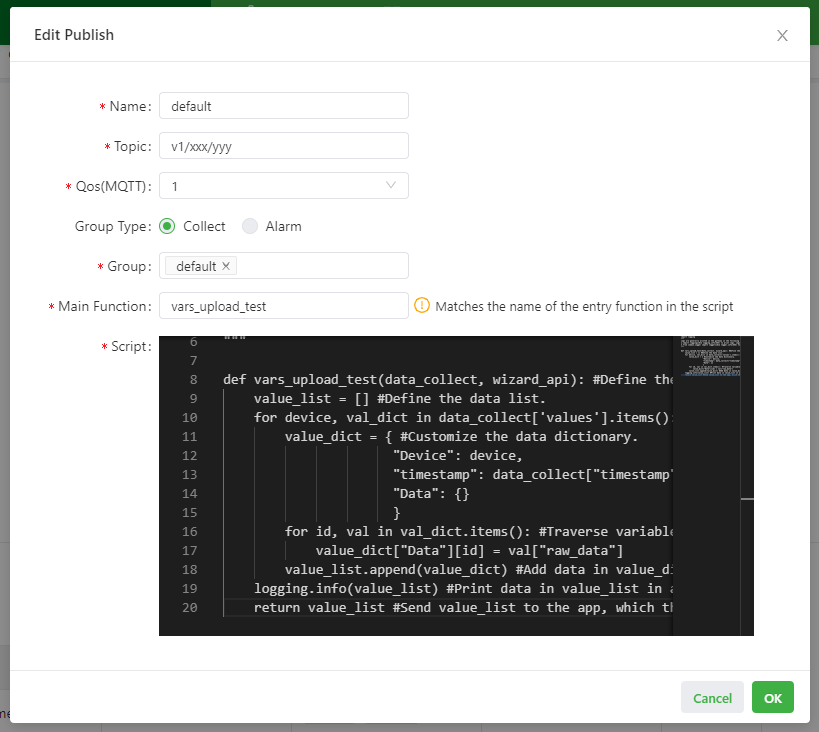
  
  ```python
  import logging
  """
  Logs are generally printed in the gateway in the following ways:
  1.import logging：Use logging.info(XXX) to print logs. Logs printed in this way are not controlled by the log level parameter on the global parameter page.
  2.from common.Logger import logger：Use logger.info(XXX) to print logs. Logs printed in this way are controlled by the log level parameter on the global parameter page.
  """
  
  def vars_upload_test(data_collect, wizard_api): #Define the main function for publish.
      value_list = [] #Define the data list.
      for device, val_dict in data_collect['values'].items(): #Traverse the values dictionary. The dictionary contains the device name and the variables of the device.
          value_dict = { #Customize the data dictionary.
                        "Device": device,
                        "timestamp": data_collect["timestamp"],
                        "Data": {}
                        }
          for id, val in val_dict.items(): #Traverse variables and assign values for the Data dictionary.
              value_dict["Data"][id] = val["raw_data"]
          value_list.append(value_dict) #Add data in value_dict to value_list in sequence.
      logging.info(value_list) #Print data in value_list in app logs in the following format: [{'Device': 'S7-1200', 'timestamp': 1589538347.5604711, 'Data': {'Test1': False, 'Test2': 12}}].
      return value_list #Send value_list to the app, which then sequential uploads it to the MQTT server by collection time. If it fails to be sent, cache the data and sequential upload it to the MQTT server by collection time after the connection recovers.
  ```

<a id="pub-example2"> </a>

- Publish example 2: Upload the alarm data in `return` mode
  
  In this example, alarm data is uploaded. The following is an example of publish and code configuration:
  
  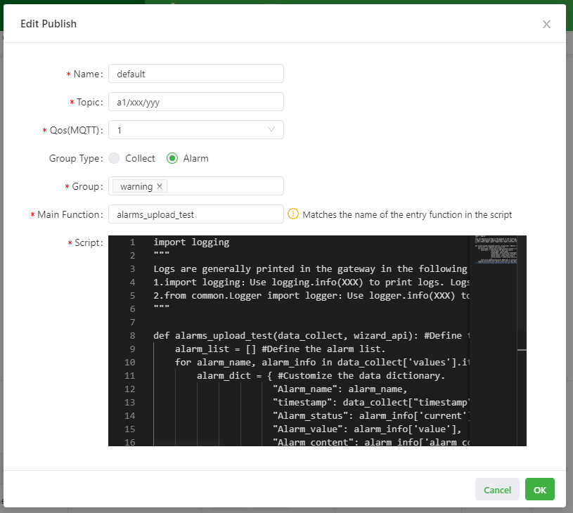
  
  ```python
  import logging
  """
  Logs are generally printed in the gateway in the following ways:
  1.import logging：Use logging.info(XXX) to print logs. Logs printed in this way are not controlled by the log level parameter on the global parameter page.
  2.from common.Logger import logger：Use logger.info(XXX) to print logs. Logs printed in this way are controlled by the log level parameter on the global parameter page.
  """
  
  def alarms_upload_test(data_collect, wizard_api): #Define the main function for publish.
      alarm_list = [] #Define the alarm list.
      for alarm_name, alarm_info in data_collect['values'].items(): #Traverse the values dictionary. The dictionary contains the information such as alarm name and alarm generation time.
          alarm_dict = { #Customize the data dictionary.
                        "Alarm_name": alarm_name,
                        "timestamp": data_collect["timestamp"],
                        "Alarm_status": alarm_info['current'],
                        "Alarm_value": alarm_info['value'],
                        "Alarm_content": alarm_info['alarm_content']
                        }
          alarm_list.append(alarm_dict) #Add data in alarm_dict to alarm_list in sequence.
      logging.info(alarm_list) #Print alarm_list in app logs.
      return alarm_list #Send alarm_list to the app, which then sequential uploads it to the MQTT server by collection time. If it fails to be sent, cache the data and sequential upload it to the MQTT server by time after the connection recovers.
  ```

<a id="pub-example3"> </a>

- Publish example 3: Use `mqtt_publish` to upload the variable data and use `save_data` to save the variable data that failed to upload.
  
  In this example, the variable data is uploaded to the MQTT server through `mqtt_publish`. If the variable data failed to upload due to MQTT connection failure, the topic, QoS, and the variable data are saved to the database through `save_data`. The saved variable data will be uploaded by saving order to the MQTT server based on the topic and QoS in the data after the MQTT connection is resumed to normal. The following is an example of publish and code configuration:
  
  
  
  ```python
  from common.Logger import logger
  import json
  from datetime import datetime
  """
  Logs are generally printed in the gateway in the following ways:
  1.import logging：Use logging.info(XXX) to print logs. Logs printed in this way are not controlled by the log level parameter on the global parameter page.
  2.from common.Logger import logger：Use logger.info(XXX) to print logs. Logs printed in this way are controlled by the log level parameter on the global parameter page.
  """
  
  def vars_cache_test(data_collect, wizard_api): #Define the main function for publish.
      value_list = [] #Define the data list.
      utc_time = datetime.utcfromtimestamp(data_collect["timestamp"]) #Convert the Linux timestamp to the UTC time.
      for device, val_dict in data_collect['values'].items(): #Traverse the values dictionary. The dictionary contains the device name and the variables of the device.
          value_dict = { #Customize the data dictionary.
                        "DeviceSN": device,
                        "Time": utc_time.strftime('%Y-%m-%dT%H:%M:%S.%fZ'),
                        "Data": {}
                         }
          for id, val in val_dict.items(): #Traverse variables and assign values for the Data dictionary.
              value_dict["Data"][id] = val["raw_data"]
          value_list.append(value_dict) #Add data in value_dict to value_list in sequence.
      if not wizard_api.mqtt_publish("v1/xxx/yyy", json.dumps(value_list), 1): #Call the mqtt_publish method of the wizard_api module to send value_list to the MQTT server based on the topic "v1/xxx/yyy" and QoS level 1, and then check whether it is successfully sent.
          value_list = {"topic": "v1/xxx/yyy", "qos": 1, "payload": value_list}
          wizard_api.save_data(value_list) #If it fails to be sent, cache the data and upload it to the MQTT server by time after the connection recovers.
          logger.info("Save data:%s" %value_list)
      logger.info(value_list) #Print value_list in app logs.
  ```

<a id="pub-example4"> </a>

- Publish example 4: Use `mqtt_publish` to upload the variable data and use `save_data` to save the variable data that failed to upload.
  
  In this example, the variable data is uploaded to the MQTT server through `mqtt_publish`. If the variable data failed to upload due to MQTT connection failure, the variable data and group name are saved through `save_data`. The saved variable data will be uploaded by saving order to the MQTT server based on the topic and QoS associated with the group in the cloud service after the MQTT connection is resumed to normal. <font color=#FF0000> Do not use the `mqtt_publish` or `save_data` method together with the `return` command</font>. The following is an example of publish and code configuration:
  
  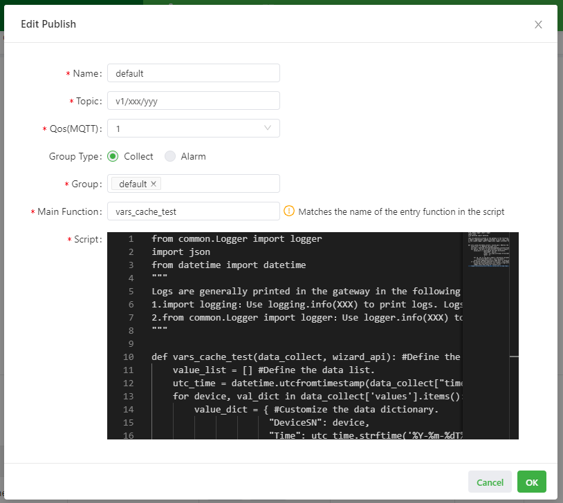
  
  ```python
  from common.Logger import logger
  import json
  from datetime import datetime
  """
  Logs are generally printed in the gateway in the following ways:
  1.import logging：Use logging.info(XXX) to print logs. Logs printed in this way are not controlled by the log level parameter on the global parameter page.
  2.from common.Logger import logger：Use logger.info(XXX) to print logs. Logs printed in this way are controlled by the log level parameter on the global parameter page.
  """
  
  def vars_cache_test(data_collect, wizard_api): #Define the main function for publish.
      value_list = [] #Define the data list.
      utc_time = datetime.utcfromtimestamp(data_collect["timestamp"]) #Convert the Linux timestamp to the UTC time.
      for device, val_dict in data_collect['values'].items(): #Traverse the values dictionary. The dictionary contains the device name and the variables of the device.
          value_dict = { #Customize the data dictionary.
                        "DeviceSN": device,
                        "Time": utc_time.strftime('%Y-%m-%dT%H:%M:%S.%fZ'),
                        "Data": {}
                         }
          for id, val in val_dict.items(): #Traverse variables and assign values for the Data dictionary.
              value_dict["Data"][id] = val["raw_data"]
          value_list.append(value_dict) #Add data in value_dict to value_list in sequence.
      if not wizard_api.mqtt_publish("v1/xxx/yyy", json.dumps(value_list), 1): #Call the mqtt_publish method of the wizard_api module to send value_list to the MQTT server based on the topic "v1/xxx/yyy" and QoS level 1, and then check whether it is successfully sent.
          wizard_api.save_data(value_list,'default') #If it fails to be sent, cache the data and upload it to the MQTT server by time after the connection recovers.
          logger.info("Save data:%s" %value_list)
      logger.info(value_list) #Print value_list in app logs.
  ```

<a id="pub-example5"> </a>

- Publish example 5: Use `get_tag_config` to get the configuration of devices, variables, and alarms.
  
  In this example, when the app is restarted each time, the configuration of devices, variables, and alarms are gotten through `get_tag_config` respectively and then sent to the MQTT server. The following is an example of publish and code configuration:
  
  
  
  ```python
  from common.Logger import logger
  import json
  """
  Logs are generally printed in the gateway in the following ways:
  1.import logging：Use logging.info(XXX) to print logs. Logs printed in this way are not controlled by the log level parameter on the global parameter page.
  2.from common.Logger import logger：Use logger.info(XXX) to print logs. Logs printed in this way are controlled by the log level parameter on the global parameter page.
  """
  
  IS_UPLOAD_CONFIG = True  #Define a variable to determine whether to acquire and upload the configuration.
  
  def upload_tagconfig(recv, wizard_api):  #Define the main function for publish.
      global IS_UPLOAD_CONFIG  #Declare that the variable is a global variable.
      if IS_UPLOAD_CONFIG:  #Determine whether to acquire and upload the configuration.
          wizard_api.get_tag_config(tagconfig)  #Call the recall_data method of the wizard_api module to define the callback function name of the method as tagconfig.
          IS_UPLOAD_CONFIG = False  #Do not upload the configuration again after it is acquired and uploaded.
  
  def tagconfig(config, tail, wizard_api): #Define the callback function tagconfig used to acquire the configuration.
      logger.info(config) #Print the configuration information, including the device, group, variable, and alarm configuration.
      deviceConfiguration_list = [] #Define the list of device configuration.
      for device in config['devices']: #Traverse the device configuration.
          deviceInfo = {} #Define the device information dictionary.
          if device['protocol'] == "ModbusTCP": #Determine whether the device communication protocol is ModbusTCP.
              deviceInfo["Device"] = device['device_name']
              deviceInfo["PLCProtocol"] = device['protocol']
              deviceInfo["IP Address"] = device['ip']
              deviceInfo["Port"] = device['port']
              deviceInfo["SlaveAddress"] = device['slave']
              deviceInfo["Endian"] = device['byte_order']
              deviceConfiguration_list.append(deviceInfo) #Add deviceInfo to deviceConfiguration_list in sequence.
          elif device['protocol'] == "ModbusRTU": #Determine whether the device communication protocol is ModbusRTU.
              deviceInfo["Device"] = device['device_name']
              deviceInfo["PLCProtocol"] = device['protocol']
              deviceInfo["Port"] = device['serial']
              deviceInfo["Baudrate"] = device['baudrate']
              deviceInfo["DataBits"] = device['bytesize']
              deviceInfo["Parity"] = device['parity']
              deviceInfo["StopBits"] = device['stopbits']
              deviceInfo["SlaveAddress"] = device['slave']
              deviceInfo["Endian"] = device['byte_order']
              deviceConfiguration_list.append(deviceInfo)
          elif device['protocol'] == "ISO-on-TCP": #Determine whether the device communication protocol is ISO-on-TCP.
              deviceInfo["Device"] = device['device_name']
              deviceInfo["PLCProtocol"] = device['protocol']
              deviceInfo["IP Address"] = device['ip']
              deviceInfo["Port"] = device['port']
              deviceInfo["Rack"] = device['rack']
              deviceInfo["Slot"] = device['slot']
              deviceConfiguration_list.append(deviceInfo)
      logger.info(deviceConfiguration_list)
      wizard_api.mqtt_publish("Config/DeviceInfo", json.dumps(deviceConfiguration_list), 1) #Call the mqtt_publish method of the wizard_api module to send deviceConfiguration_list to the MQTT server based on the topic "Config/DeviceInfo" and QoS level 1.
  
  
      tagConfiguration_list = [] #Define the list of variable configuration.
      device_group_info_dict = {} #Define the group information dictionary of a device.
      group_info_dict = {} #Define the group information dictionary.
      for groupinfo in config['groups']: #Traverse the groups in the configuration.
          group_info_dict[groupinfo["group_name"]] = groupinfo #Map the group names and group information.
      for device in config['devices']: #Traverse the devices in the configuration.
          group_list= [] #Define the group list of a device.
          for var in config['vars']: #Traverse the variables in the configuration.
              if device['device_name'] == var['device'] and var['group'] not in group_list: #Determine whether the variable is in the device. If the group of the variable is not in group_list, add the group to group_list.
                  group_list.append(var['group'])
          device_group_info_dict[device['device_name']] = group_list #Map the devices and the group lists of the devices.
      for device, group_list in device_group_info_dict.items(): #Traverse the group information dictionary of a device.
          if group_list == []: #If the group list of the device is empty, no variable is defined for the device. Then, skip this device.
              continue
          tagConfiguration = {} #Define the variable configuration dictionary.
          tagConfiguration["Device"] = device #Add device information.
          tagConfiguration["Collections"] = []
          for group in group_list: #Traverse the groups of a device and add group information.
              group_info = {}
              group_info["CollectionName"] = group
              group_info["SampleRate"] = group_info_dict[group]["polling_interval"]
              group_info["PublishInterval"] = group_info_dict[group]["upload_interval"]
              group_info["TagData"] = []
              tagConfiguration["Collections"].append(group_info)
              for var in config['vars']: #Traverse the variables in the configuration.
                  if var['device'] != device or var['group'] != group: #If the variable does not belong to the device and group, skip this variable.
                      continue
                  index_number = tagConfiguration["Collections"].index(group_info) #Obtain the index of the group in tagConfiguration["Collections"].
                  data_info = {} #Define the variable information dictionary.
                  data_info["Tag"] = var["var_name"]
                  data_info["Address"] = var["address"]
                  data_info["ValueType"] = var["data_type"]
                  data_info["AccessLevel"] = var["read_write"]
                  data_info["Mode"] = var["mode"]
                  data_info["Unit"] = var["unit"]
                  data_info["Description"] = var["desc"]
                  tagConfiguration["Collections"][index_number]["TagData"].append(data_info) #Add variable information to TagData of the specified group.
          tagConfiguration_list.append(tagConfiguration) #Add the tagConfiguration to tagConfiguration_list in sequence.
      logger.info(tagConfiguration_list) #Print the variable Configuration.
      for tagConfiguration in tagConfiguration_list: #Traverse the variable Configuration of each device and upload them to the MQTT server.
          wizard_api.mqtt_publish("Config/TagConfiguration", json.dumps(tagConfiguration), 1) #Call the mqtt_publish method of the wizard_api module to send tagConfiguration_list to the MQTT server based on the topic "Config/TagConfiguration" and QoS level 1.
  
  
      alarmConfiguration_list = [] #Define the alarm configuration.
      for alarm in config['warning']: #Traverse the alarms in the configuration.
          alarmInfo = {} #Define the alarm information dictionary.
          alarmInfo['Warn_name'] = alarm['warn_name']
          alarmInfo['Group'] = alarm['group']
          alarmInfo['Alarm_content'] = alarm['alarm_content']
          alarmInfo['Condition1'] = alarm['condition1']
          alarmInfo['Operand1'] = alarm['operand1']
          alarmInfo['Combine_method'] = alarm['combine_method']
          alarmInfo['Condition2'] = alarm['condition2']
          alarmInfo['Operand2'] = alarm['operand2']
          alarmInfo['Device'] = alarm['device']
          alarmInfo['Var_name'] = alarm['var_name']
          alarmInfo['Address'] = alarm['address']
          alarmConfiguration_list.append(alarmInfo) #Add the alarm information to alarmConfiguration_list in sequence.
      logger.info(alarmConfiguration_list) #Print the alarm configuration.
      wizard_api.mqtt_publish("Config/AlarmInfo", json.dumps(alarmConfiguration_list), 1) #Call the mqtt_publish method of the wizard_api module to send alarmConfiguration_list to the MQTT server based on the topic "Config/AlarmInfo" and QoS level 1.
  ```

<a id="pub-example6"> </a>

- Publish example 6: Use `get_global_parameter` to get global parameter settings.
  
  In this example, parameters set in **Global Parameter** are gotten through `device_id`, and the MQTT topic is configured with the wildcard `${device_id}`. The following is an example of publish and code configuration:
  
  
  
  
  
  ```python
  import logging
  """
  Logs are generally printed in the gateway in the following ways:
  1.import logging：Use logging.info(XXX) to print logs. Logs printed in this way are not controlled by the log level parameter on the global parameter page.
  2.from common.Logger import logger：Use logger.info(XXX) to print logs. Logs printed in this way are controlled by the log level parameter on the global parameter page.
  """
  
  def vars_upload_test(data_collect, wizard_api): #Define the main function for publish.
      global_parameter = wizard_api.get_global_parameter() #Define the global variables.
      logging.info(global_parameter) #Print the global variables.
      value_list = [] #Define the data list.
      for device, val_dict in data_collect['values'].items(): #Traverse the values dictionary. The dictionary contains the device name and the variables of the device.
          value_dict = { #Customize the data dictionary.
                        "Device": device,
                        "DeviceID": global_parameter["device_id"], #Acquire the device ID defined in global variables.
                        "timestamp": data_collect["timestamp"],
                        "Data": {}
                        }
          for id, val in val_dict.items(): #Traverse variables and assign values for the Data dictionary.
              value_dict["Data"][id] = val["raw_data"]
          value_list.append(value_dict) #Add data in value_dict to value_list in sequence.
      logging.info(value_list) #Print data in value_list in app logs in the following format: [{'Device': 'S7-1200', 'DeviceID': '1', 'timestamp': 1589538347.5604711, 'Data': {'Test1': False, 'Test2': 12}}].
      return value_list #Send value_list to the app, which then sequential uploads it to the MQTT server by collection time. If it fails to be sent, cache the data and sequential upload it to the MQTT server by time after the connection recovers.
  ```

<a id="subscribe"> </a>

#### Subscribe

Custom subscribe contains the following items:

- `Name`: The custom subscribe name.
- `Topic`: The subscribe topic, which must be consistent with the topic published by the MQTT server.
- `Qos(MQTT)`: The subscribe QoS, which is recommended to be consistent with that of the MQTT server.
- `Main Function`: The name of the main function (entry function), which must be consistent with that in the script.
- `Script`: Use the Python code to custom the packaging and processing logic. Main functions in subscribe include the following parameters:
  - `Parameter 1`: It is the received topic. The data type is `string`.
  - `Parameter 2`: It is the received data. The data type is `string`.
  - `Parameter 3`: It is the API provided by Device Supervisor. For more information about it, see [Device Supervisor API Description.](#device_supervisor_api_description)

The following are three common custom subscribe methods:

<a id="sub-example1"> </a>

- Subscribe example 1: Deliver the variable name and value and write the PLC data but do not return the write result.
  
  In this example, a command is delivered by the MQTT server to modify the variable value. The following is an example of publish and code configuration:
  
  
  
  ```python
  import logging
  import json
  
  def ctl_test(topic, payload, wizard_api): #Define the main function for subscribe.
      logging.info(topic) #Print the subscribe topic. Assume that the topic is "write/plc".
      logging.info(payload) #Print the subscribe data. Assume that the payload data is {"method":"setValue", "TagName":"SP1", "TagValue":12.3}.
      payload = json.loads(payload) #Deserialize subscribe data.
      if payload["method"] == "setValue": #Check whether the data is written.
          message = {payload["TagName"]:payload["TagValue"]} #Define the message to be delivered, including the variable name and value to be delivered.
          wizard_api.write_plc_values(message) #Call the write_plc_values method of the wizard_api module to deliver data from the message dictionary to the specified variable.
  ```

<a id="sub-example2"> </a>

- Subscribe example 2: Deliver the device name, and variable name and value and write the PLC data but do not return the write result.
  
  In this example, a command is delivered by the MQTT server to modify the variable value. The following is an example of publish and code configuration:
  
  
  
  ```python
  import logging
  import json
  
  def ctl_test(topic, payload, wizard_api): #Define the main function for subscribe.
      logging.info(topic) #Print the subscribe topic.
      logging.info(payload) #Print the subscribe data.
      #Assume that the payload data is {"method":"setValue","Device":"Modbus_test", "TagName":"SP1", "TagValue":12.3}.
      payload = json.loads(payload) #Deserialize subscribe data.
      data_dict = {payload["TagName"]:payload["TagValue"]} #Define the data dictionary to be delivered, including the variable name and value to be delivered.
      var_device = payload["Device"] #Define the name of the device.
      if payload["method"] == "setValue": #Check whether the data is written.
          message = {var_device:data_dict} #Define the message to be delivered, including the device name and data dictionary to be delivered.
          wizard_api.write_plc_values(message) #Call the write_plc_values method of the wizard_api module to deliver data from the message dictionary to the specified variable.
  ```

<a id="sub-example3"> </a>

- Subscribe example 3: Write the variable data and return the write result.
  
  In this example, a command is delivered by the MQTT server to modify the variable value and return the modification result. The following is an example of publish and code configuration:
  
  
  
  ```python
  import logging
  import json
  
  def ctl_test(topic, payload, wizard_api): #Define the main function for subscribe.
      logging.info(topic) #Print the subscribe topic. Assume that the topic is "request/v1".
      logging.info(payload) #Print the subscribe data.
      #Assume that the payload data is {"method":"setValue","Device":"Modbus_test", "TagName":"SP1", "TagValue":12.3}.
      payload = json.loads(payload) #Deserialize subscribe data.
      data_dict = {payload["TagName"]:payload["TagValue"]} #Define the data dictionary to be delivered, including the variable name and value to be delivered.
      var_device = payload["Device"] #Define the name of the device.
      if payload["method"] == "setValue": #Check whether the data is written.
          message = {var_device:data_dict} #Define the message to be delivered, including the device name and data dictionary to be delivered.
          ack_tail = [topic.replace('request', 'response'), message] #Define the confirmation data, including the response topic and message.
          logging.info(message)
          wizard_api.write_plc_values(message, ack, ack_tail, timeout = 0.5) #Call the write_plc_values method of the wizard_api module to deliver data from the message dictionary to the specified variable. Define the callback function of this method as ack and deliver ack_tail to the ack function.
  
  def ack(send_result, ack_tail, wizard_api): #Define the callback function ack.
      topic = ack_tail[0] #Define the response topic.
      if isinstance(send_result,tuple): #Check whether the data type of send-result is tuple. If so, the delivery times out.
          resp_data = {"Status":"timeout", "Data":ack_tail[1]} #Define the response for delivery timeout.
      else:
          resp_data = {"Status":send_result[0]["result"], "Data":ack_tail[1]} #Define the response if the delivery does not time out.
      wizard_api.mqtt_publish(topic, json.dumps(resp_data), 0) #Call the mqtt_publish method of the wizard_api module to deliver the response data to the MQTT server.
  ```

<a id="sub-example4"> </a>

- Subscribe example 4: Recall the data immediately.
  
  In this example, when the specified command is delivered by the MQTT server, the system immediately reads values of all variables and sends them to the MQTT server. The following is an example of publish and code configuration:
  
  
  
  ```python
  from common.Logger import logger
  import json
  
  def recall_test(topic, payload, wizard_api): #Define the main function for subscribe.
      logger.info(topic) #Print the subscribe topic. Assume that the topic is "recall/v1".
      payload = json.loads(payload) #Deserialize subscribe data.
      logger.info(payload) #Print the subscribe data. Assume that the payload data is {"command":"Upload immediately"}.
      if payload["command"] == "Upload immediately": #Check whether to call back the data.
          wizard_api.recall_data(recall) #Call the recall_data method of the wizard_api module to define the callback function name of the method as recall.
  
  def recall(data_collect, tail, wizard_api): #Define the callback function recall.
      logger.info(data_collect) #Print the read data.
      value_list = [] #Define the data list.
      for device, val_dict in data_collect["values"].items(): #Traverse the values dictionary. The dictionary contains the device name and the variables of the device.
          value_dict = { #Customize the data dictionary.
                        "DeviceSN": device,
                        "timestamp": data_collect["timestamp"],
                        "Data": []
                         }
          for id, val in val_dict.items(): #Traverse variables and assign values for the Data list.
              var_dict = {} #Define the variable dictionary.
              var_dict[id] = val["raw_data"]
              value_dict["Data"].append(var_dict) #Add variable dictionaries to value_dict in sequence.
          value_list.append(value_dict) #Add data dictionaries to value_list in sequence.
      logger.info(value_list) #Print value_list. 
      wizard_api.mqtt_publish("v1/xxx/yyy", json.dumps(value_list), 1) #Call the mqtt_publish method of the wizard_api module to send value_list to the MQTT server based on the topic "v1/xxx/yyy" and QoS level 1.
  ```

<a id="device_supervisor_api_description"> </a>

#### Device Supervisor API Description

The API provided by Device Supervisor supports the following methods:

- `mqtt_publish`: The MQTT message publish method. It is used to send the specified data to the MQTT server based on the topic and return the sending result (True or False). For its usage example, see [Publish example 3](#pub-example3). This method contains the following parameters:
  - `Parameter 1`: The MQTT topic. The data type is `string`. This topic is used to send the data to the MQTT server.
  - `Parameter 2`: The data to be sent.
  - `Parameter 3`: The QoS level. Valid values are 0, 1, and 2.

- `save_data`: The method for saving data to the database. The saved data will be uploaded by saving order to the MQTT server when the MQTT connection is resumed to normal. For its usage example, see [Publish example 3](#pub-example3) and [Publish example 4](#pub-example4). This method contains the following parameters:
  
  - `Parameter 1`: The data to be saved. If only `Parameter 1` is provided when `save_data` is called, the data type of `Parameter 1` is `dict`, the saved data must have key-value pairs with `topic`, `qos`, and `payload` as the keys, and the saved data is sent to the MQTT server based on its `topic`, `qos`, and `payload` after the MQTT connection is resumed to normal.
  - `Parameter 2` (`group` is optional): The group name of the data to be saved. The data type is `string`. When `save_data` is called, if `Parameter 2` is provided, `Parameter 1` is sent to the MQTT server based on the topic and QoS associated with this group in the cloud service.

- `write_plc_values`: Deliver the data to the specified variable method and return the modification result. For its usage example, see [Subscribe example 1](#sub-example1), [Subscribe example 2 ](#sub-example2)and [Subscribe example 3](#sub-example3). This method contains the following parameters:
  - `Parameter 1`: Deliver the data. Two forms are supported:
    - `Form 1`: Input a `dict` which uses the variable name and value as the key-value pair. When using this method to modify the variable value, keep the variable name unique in the **Device list**. The following is a data format example:
      ```python
      {
          "SP1": 12.3,  #The key-value pair of the variable name and value.
          "SP2": 12.4
      }
      ```
    - `Form 2`: Input a `dict` that contains the device name and variable name and value. The following is a data format example:
      ```python
      {
          "S7-1200":  #The name of the device.
          {
              "SP1": 12.3,  #The key-value pair of the variable name and value.
              "SP2": 12.4
          }
      }
      ```
  - `Parameter 2` (`callback` is optional): The name of the callback function that returns the modification result. For more information about the callback function, see [Description of the write_plc_values callback function.](#write-plc-values-callback-function-description)
  - `Parameter 3` (`tail` is optional): When `Parameter 2` is available, you can assign the data that needs to be sent to the callback function returning the modification result to `Parameter 3`.
  - `Parameter 4` (`timeout` is optional): The write timeout time. The data type is `Integer`. The default value is 60s.

- `get_tag_config`: The method to get the configurations, including the PLC, variable, group, and alarm configurations. For its usage example, see [Publish example 5](#pub-example5). This method contains the following parameters:
  - `Parameter 1`: The name of the callback function that gets the configuration. For more information about the callback function, see [Description of the get_tag_config callback function.](#get-tag-config-callback-function-description)
  - `Parameter 2` (`tail` is optional): It can be used to assign the data that needs to be sent to the callback function getting the configuration to `Parameter 2`.
  - `Parameter 3` (`timeout` is optional): The timeout time for getting the configuration. The data type is `Integer`. The default value is 60s.

- `recall_data`: The method that is used to read values of all variables immediately. For its usage example, see [Subscribe example 4](#sub-example4). This method contains the following parameters:
  - `Parameter 1`: The name of the callback function that immediately reads values of all variables. For more information about the callback function, see [Description of the recall_data callback function.](#recall-data-callback-function-description)
  - `Parameter 2` (`tail` is optional): It can be used to assign the data that needs to be sent to the callback function immediately reading values of all variables to `Parameter 2`.
  - `Parameter 3` (`timeout` is optional): The timeout time for immediately reading values of all variables. The data type is `Integer`. The default value is 60s.

- `get_global_parameter`: The method to get the global parameter settings. For its usage example, see [Publish example 6](#pub-example6). This method returns a dictionary for global parameter settings. The data format is as follows:
  
  ```python
  {
      'gateway_sn': 'GT902XXXXXXXXXX', #The gateway serial number, which is a system parameter.
      'log_level': 'INFO', #The log level, which is a system parameter.
      'catch_recording': 100000, #The maximum number of MQTT messages of variables that can be cached.
      'warning_recording': 2000, #The maximum number of MQTT messages of alarms that can be cached.
      'device_id': '1' #The custom global parameter.
  }
  ```

<a id="callback-function-description"> </a>

#### Callback function description

<a id="write-plc-values-callback-function-description"> </a>

- `write_plc_values` Callback function description  
`write_plc_values`The callback function contains the following parameters. For its usage example, see [Subscribe example 3](#sub-example3):
  - `Parameter 1`: The write result of the `write_plc_values` method.
    - When write times out, the returned value is
      ```python
      ("error", -110, "timeout")
      ```
    - When write succeeds, the format of the returned value is:
      ```python
      [
      {
          'value': 12, #The written value.
          'device': 'S7-1200', #The written device.
          'var_name': 'Test2', #The written variable name.
          'result': 'OK', #The written result. OK: writing succeeded; Failed: writing failed.
          'error': '' #The writing error. When the writing result is OK, this parameter is empty.
      }]
      ```;
      ```
    - When write failed, the format of the returned value is:
      ```python
      [
      {
          'value': 12.3,
          'device': 'Modbus_test',
          'var_name': 'SP1',
          'result': 'Failed',
          'error': "Device 'Modbus_test' not found."
      }]
      ```
  - `Parameter 2`: The `Parameter 3` configured in the `write_plc_values` method. If `Parameter 3` is not configured in `write_plc_values`, this parameter is `None`.
  - `Parameter 3`: It is the API provided by Device Supervisor. For more information about it, see [Device Supervisor API Description.](#device_supervisor_api_description)

<a id="get-tag-config-callback-function-description"> </a>

- `get_tag_config` Callback function description  
`get_tag_config`The callback function contains the following parameters. For its usage example, see [Publish example 5](#pub-example5):
  - `Parameter 1`: The configuration returned by the `get_tag_config` method. When getting configuration times out, the returned value is `("error", -110, "timeout")`; otherwise, the data format is as follows:
    
    ```python
    {
        'devices': [ #The device configuration.
        {
            'protocol': 'ISO-on-TCP', #The device protocol.
            'device_name': 'S7-1200', #The name of the device.
            'ip': '10.5.16.73', #The IP address.
            'port': 102, #Port
            'rack': 0, #The rack number.
            'slot': 0, #The slot number.
            'id': '6358f50294dc11ea8d890018050ff046' #The device ID.
        }],
        'groups': [ #The group configuration.
        {
            'group_name': 'warning', #The group name.
            'polling_interval': 10, #The collection interval.
            'upload_interval': '', #The reporting interval.
            'group_type': 'alarm', #The group type. collect: collect group; alarm: alarm group.
            'id': '84c371902eb911eabab11a4f32d1ee44' #The group ID.
        }],
        'warning': [ #The alarm configuration.
        {
            'warn_name': 'Warn1', #The alarm name.
            'group': 'warning', #The group of the alarm.
            'quotes': 1, #The variable source of the alarm. 0: direct use address; 1: reference address.
            'device': 'S7-1200', #The device of the alarm variable.
            'alarm_content': 'The speed has exceeded 30!'  #The alarm description.
            'condition1': 'Gt', #The alarm condition 1. Eq: equal to; Neq: not equal to; Gt: grater than; Gne: greater than or equal to; Lne: less than or equal to; Lt: less than.
            'operand1': '30', #The alarm threshold 1.
            'combine_method': 'And', #The connection mode of alarm conditions. None: empty; And: &&; Or: ||
            'condition2': 'Lt', #The alarm condition 2.
            'operand2': '50', #The alarm threshold 2.
            'var_name': 'Test2', #The variable name of the alarm.
            'var_id': '96c93c3094dd11eabd400018050ff046', #The variable ID of the alarm.
            'size': 1, #The length of the string when the data type of the alarm variable is STRING.
            'float_repr': 2, #The number of digits following the decimal point of the variable when the data type of the alarm variable is FLOAT.
            'id': '9165ed78943e11ea8a000018050ff046', #The alarm ID.
            'address': 'DB6.2', #The variable address of the alarm.
            'protocol': 'ISO-on-TCP', #The communication protocol of the alarm device.
            'data_type': 'WORD', #The data type of the alarm variable.
            'register_type': 'DB', #The register type of the alarm variable.
            'register_addr': 2, #The register address of the alarm variable.
            'read_write': 'read/write', #The read/write permission of the alarm. read: read-only; write: write-only; read/write: read and write.
            'mode': 'realtime', #The variable collection mode of the alarm.
            'unit': '', #The variable unit of the alarm.
            'desc': '', #The variable description of the alarm.
            'dbnumber': 6, #The DB number of the variable when the register type of the alarm variable is DB.
            'register_bit': '' #The offset of the variable when the data type of the alarm variable is BOOL or BIT.
        }],
        'vars': [ #The variable configuration.
        {
            'device': 'S7-1200', #The name of the device to which the variable belongs.
            'protocol': 'ISO-on-TCP', #The communication protocol of the device to which the variable belongs.
            'data_type': 'BOOL', #The data type of the variable.
            'register_type': 'I', #The register type of the variable.
            'var_name': 'Test1', #The variable name.
            'register_addr': 0, #The register address of the variable.
            'read_write': 'read/write', #The read/write permission of the variable. read: read-only; write: write-only; read/write: read and write.
            'mode': 'realtime', #The collection mode of the variable.
            'unit': '', #The unit of the variable.
            'desc': '', #The description of the variable.
            'group': 'default', #The group of the variable.
            'register_bit': 0, #The offset of the variable when the data type of the variable is BOOL or BIT.
            'size': 1, #The length of the string when the data type of the variable is STRING.
            'float_repr': 2, #The length of the data following the decimal point of the variable when the data type of the variable is FLOAT.
            'dbnumber': 0, #The DB number of the variable when the register type of the variable is DB.
            'id': 'a1d9439a94dc11eaa2830018050ff046', #The ID of the variable.
            'address': 'I0.0' #The address of the variable.
        },
        {
            'device': 'S7-1200',
            'protocol': 'ISO-on-TCP',
            'data_type': 'WORD',
            'register_type': 'DB',
            'var_name': 'Test2',
            'register_addr': 2,
            'read_write': 'read/write',
            'mode': 'realtime',
            'unit': '',
            'desc': '',
            'group': '2222',
            'dbnumber': 6,
            'size': 1,
            'float_repr': 2,
            'register_bit': '',
            'id': '96c93c3094dd11eabd400018050ff046',
            'address': 'DB6.2'
        }]
    }
    ```
  
  - `Parameter 2`: The `Parameter 3` configured in the `get_tag_config` method. If `Parameter 3` is not configured in `get_tag_config`, this parameter is `None`.
  
  - `Parameter 3`: It is the API provided by Device Supervisor. For more information about it, see [Device Supervisor API Description.](#device_supervisor_api_description)

<a id="recall-data-callback-function-description"> </a>

- `recall_data` Callback function description  
`recall_data`The callback function contains the following parameters. For its usage example, see [Subscribe example 4](#sub-example4):
  - `Parameter 1`: The variable data returned by the `recall_data` method. When getting variable data times out, the returned value is `("error", -110, "timeout")`; otherwise, the data format is as follows:
    
    ```python
    {
        'timestamp': 1589507333.2521989,  #The timestamp when data is generated.
        'values':  #The data dictionary, including the PLC name, variable name, and variable value.
        {
            'S7-1200':  #The PLC name.
            {
                'Test1':  #The variable name.
                {
                    'raw_data': False,  #The variable value.
                    'status': 1  #The collection status. If the value is not 1, the collection is abnormal.
                },
                'Test2':
                {
                    'raw_data': 33,
                    'status': 1
                }
            }
        }
    }
    ```
  
  - `Parameter 2`: The `Parameter 3` configured in the `recall_data` method. If `Parameter 3` is not configured in `recall_data`, this parameter is `None`.
  
  - `Parameter 3`: It is the API provided by Device Supervisor. For more information about it, see [Device Supervisor API Description.](#device_supervisor_api_description)

<a id="global_parameters"> </a>

### Global parameters

You can choose **Edge Computing > Device Supervisor > Global Parameter** and configure global settings for Device Supervisor.

- Global parameters  
  In the global parameter module, you can set system parameters for Device Supervisor or add wildcard parameters.
  
  - `catch_recording`: The number of MQTT messages of the variable data that can be cached. The default value is `100000`.
  
  - `log_level`: The log level. Different logs are displayed in Device Supervisor for different log levels. The default value is `INFO`.
  
  - `warning_recording`: The number of MQTT messages of the alarm data that can be cached. The default value is `2000`.
  
  - `Custom Wildcard`: You can add global parameters as wildcards and use them in the cloud service. The usage is `${Parameter Name}`, as shown in the figure below:  
    
      

- Serial port settings  
  In the serial port setting module, you can configure communication parameters for the serial ports RS485 and RS232, as shown in the figure below:  
  
  

<a id="other_gateway_operations"> </a>

### Other gateway operations

For more information about other common gateway operations, see [Get Started with IG501](http://fw.ig.inhandnetworks.com/en/latest/IG501-Quick-Start-Manual.html) or [Get Started with IG902](http://fw.ig.inhandnetworks.com/en/latest/IG902-Quick-Start-Manual.html).

<a id="thingsBoard_reference_flowchart"> </a>

### ThingsBoard reference flowchart

- [Add devices and assets](#add_devices_and_assets)
- [Transmit the PLC data to ThingsBoard devices](#transmit_the_plc_data_to_thingsBoard_devices)
- [Configure a visual dashboard](#configure_a_visual_dashboard)

<a id="add_devices_and_assets"> </a>

#### Add devices and assets

Visit `https://demo.thingsboard.io/login` and enter the login account and password. If you do not have an account yet, register an account first before login. Registration requires access to the network outside China.


- Add an asset
  
  
  
  After the asset is added, the page is as follows:
  
  

- Add a device
  
  
  
  
  
  Associate the asset with the device.
  
  
  
  After the device is added, the page is as follows:
  
  

<a id="transmit_the_plc_data_to_thingsBoard_devices"> </a>

#### Transmit the PLC data to ThingsBoard devices

After configuring the asset and device, copy the access token of the added device and paste it to the username field on the cloud service page of the gateway, and then transmit the data to the `S7-1200` device in ThingsBoard.


Then, you can view the uploaded data in the latest telemeter of the device.


<a id="configure_a_visual_dashboard"> </a>

#### Configure a visual dashboard

- [Add a dashboard](#add_a_dashboard)
- [Add a trend chart](#add_a_trend_chart)
- [Add a switch](#add_a_switch)

<a id="add_a_dashboard"> </a>

- Add a dashboard
  
  Click **Add Dashboard** and select **Create new dashboard**. On the Add Dashboard page, configure and add a dashboard.
  
  
  
  Then, click the dashboard name, and select **OPEN DASHBOARD**.
  
  
  
  Click **Enter edit mode**.
  
  
  
  Click **Entity aliases** to add an entity alias for the dashboard.
  
  
  
  On the Entity Alias page, configure it according to the following figure:
  
  
  
  Save it after configuration.
  
  

<a id="add_a_trend_chart"> </a>

- Add a trend chart
  
  On the dashboard page, click **Enter edit mode** and then click **Add new widget**.
  
  
  
  
  
  Select **Charts** from components and click **Timeseries-Flot**.
  
  
  
  On the **DATA** page of the chart, add data to the trend chart.
  
  
  
  
  
  After the data is added, the page is as follows:
  
  

<a id="add_a_switch"> </a>

- Add a switch
  
  Click **Add new widget**, select **Create new widget**, and add a control switch.
  
  
  
  Select **Control widgets** from components, and click **Round switch**.
  
  
  
  Select the target device.
  
  
  
  After configuration, adjust the component size and layout, and save the configuration.
  
  
  
  Then, you can use the switch to deliver control commands and view data trends through the trend charts.
  
  

<a id="faq"> </a>

## FAQ

- Check whether the cloud service script is correct  
  Open the log of Device Supervisor App Write the script and click **OK**. The `Build module: <Main Function Name>, type: <publish/subscribe>` information in the log shows whether the script is built successfully.
  
  If the script is built successfully, the page is as follows:
  
  
  
  If the script failed to build, the page is as follows:
  
  

- Check whether the App's cloud service output is correct  
  You can use `logger` and `logging` to output important logs. In the following figure, the `logging.info` method is added in the sixth line of the script. You can search for `<string> 6` in the log to check whether the output results meet the expectation.
  
  
